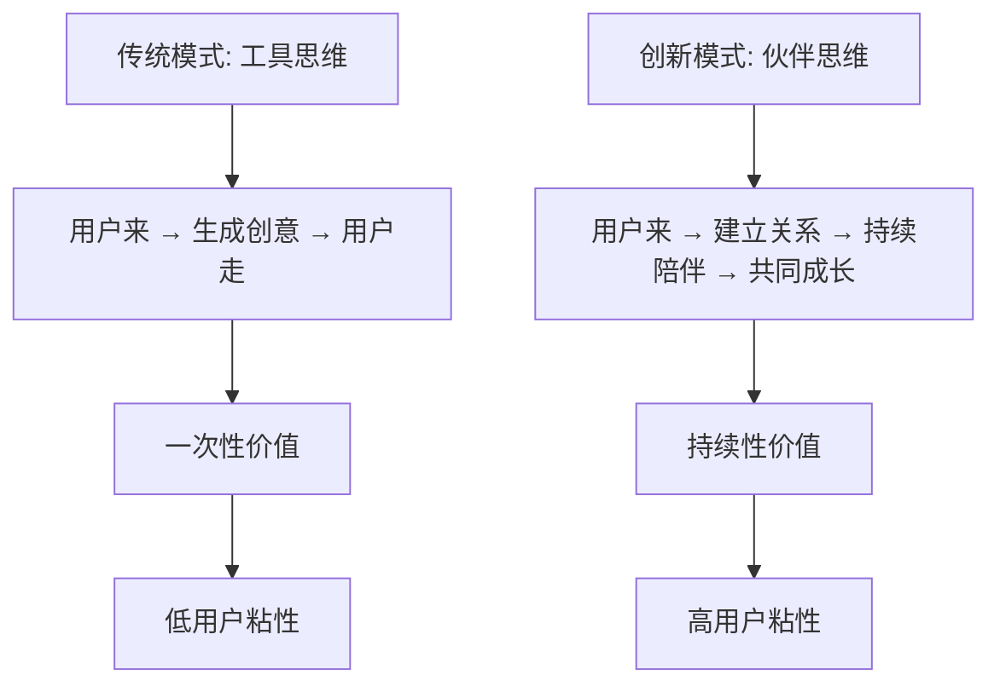

# 深度产品创新与战略思考

## 🧠 深层次用户洞察与创新机会

### 1. 重新定义"创意生成"的本质

#### 从工具到伙伴的转变
当前的AI创意生成器本质上还是一个"工具"，用户使用完就离开。我们需要重新思考：

**核心洞察**: 创业者真正需要的不是创意，而是**创业信心和持续的支持**。



#### 重新定义产品价值主张
```typescript
interface ValueProposition {
  traditional: {
    core: "生成商业创意";
    user_journey: "需要创意 → 使用工具 → 获得结果 → 离开";
    relationship: "交易型";
  };
  
  innovative: {
    core: "成为创业者的AI创业伙伴";
    user_journey: "创业想法 → 建立伙伴关系 → 持续指导 → 共同成长 → 成功创业";
    relationship: "伙伴型";
  };
}
```

### 2. 创新的产品概念：AI创业伙伴生态

#### 核心概念：从"生成器"到"创业伙伴"
```typescript
interface AIEntrepreneurPartner {
  // 不再是单纯的创意生成，而是全程创业陪伴
  capabilities: {
    ideaGeneration: "创意激发与验证";
    businessPlanning: "商业计划制定";
    marketAnalysis: "市场分析与定位";
    resourceMatching: "资源匹配与对接";
    progressTracking: "进度跟踪与提醒";
    emotionalSupport: "情感支持与鼓励";
    learningGuidance: "学习路径规划";
    networkBuilding: "人脉网络构建";
  };
  
  // AI伙伴的人格化特征
  personality: {
    expertise: "深度行业知识";
    empathy: "理解创业者的焦虑和兴奋";
    persistence: "持续的支持和鼓励";
    adaptability: "根据用户成长调整指导方式";
  };
}
```

### 3. 突破性功能创新

#### 3.1 AI创业导师系统
```typescript
interface AIEntrepreneurMentor {
  // 个性化AI导师，不同专业背景
  mentorProfiles: {
    techFounder: {
      name: "Alex Chen";
      background: "连续技术创业者，3次成功退出";
      expertise: ["技术产品", "团队建设", "融资策略"];
      personality: "理性、数据驱动、注重执行";
    };
    
    businessStrategist: {
      name: "Sarah Wang";
      background: "前麦肯锡合伙人，投资人";
      expertise: ["商业模式", "市场策略", "运营优化"];
      personality: "战略思维、市场敏感、注重ROI";
    };
    
    creativeVisionary: {
      name: "David Liu";
      background: "设计出身的创业者，品牌专家";
      expertise: ["用户体验", "品牌建设", "创意营销"];
      personality: "创意思维、用户导向、注重体验";
    };
  };
  
  // 导师匹配算法
  matchingAlgorithm: {
    userProfile: "分析用户背景、性格、创业方向";
    mentorCompatibility: "匹配最适合的导师人格";
    dynamicAdjustment: "根据互动效果调整导师风格";
  };
}
```

#### 3.2 创业旅程地图系统
```typescript
interface EntrepreneurJourneyMap {
  // 将创业过程可视化为RPG游戏式的成长路径
  journeyStages: {
    ideation: {
      name: "创意探索者";
      level: 1;
      tasks: ["市场调研", "用户访谈", "竞品分析"];
      rewards: ["解锁商业画布", "获得导师指导"];
      nextStage: "validation";
    };
    
    validation: {
      name: "需求验证师";
      level: 2;
      tasks: ["MVP开发", "用户测试", "数据收集"];
      rewards: ["解锁融资工具", "专家网络访问"];
      nextStage: "building";
    };
    
    building: {
      name: "产品构建者";
      level: 3;
      tasks: ["产品开发", "团队组建", "运营优化"];
      rewards: ["解锁高级分析", "投资人对接"];
      nextStage: "scaling";
    };
  };
  
  // 成就系统
  achievementSystem: {
    badges: ["首次用户验证", "第一个付费客户", "团队组建完成"];
    milestones: ["月收入1万", "用户破千", "完成A轮融资"];
    leaderboard: "创业者成长排行榜";
  };
}
```

#### 3.3 智能创业决策引擎
```typescript
interface SmartDecisionEngine {
  // 基于大数据的创业决策支持
  decisionSupport: {
    marketTiming: {
      analysis: "分析市场时机和趋势";
      recommendation: "建议进入时机和策略";
      riskAssessment: "评估市场风险和机会";
    };
    
    competitorStrategy: {
      positioning: "建议差异化定位策略";
      pricingStrategy: "优化定价模型";
      marketEntry: "制定市场进入策略";
    };
    
    resourceAllocation: {
      budgetOptimization: "预算分配建议";
      teamBuilding: "团队组建优先级";
      technologyStack: "技术选型建议";
    };
  };
  
  // 预测性分析
  predictiveAnalytics: {
    successProbability: "基于历史数据预测成功概率";
    cashflowForecast: "现金流预测和预警";
    growthProjection: "增长轨迹预测";
  };
}
```

### 4. 革命性的交互模式

#### 4.1 沉浸式创业模拟器
```typescript
interface EntrepreneurshipSimulator {
  // VR/AR增强的创业体验
  immersiveExperience: {
    virtualOffice: "3D虚拟办公环境";
    teamMeeting: "虚拟团队会议室";
    pitchPractice: "投资人路演练习";
    marketSimulation: "市场环境模拟";
  };
  
  // 情景化学习
  scenarioLearning: {
    crisisManagement: "危机处理情景";
    negotiationPractice: "商务谈判练习";
    leadershipChallenges: "领导力挑战";
    customerInteraction: "客户沟通模拟";
  };
}
```

#### 4.2 AI驱动的创业社交网络
```typescript
interface AIEntrepreneurNetwork {
  // 智能匹配的创业者网络
  intelligentMatching: {
    cofounderMatching: "联合创始人匹配";
    mentorConnection: "导师连接";
    investorIntroduction: "投资人介绍";
    partnershipOpportunities: "合作机会发现";
  };
  
  // 基于AI的社交推荐
  socialRecommendations: {
    networkingEvents: "推荐相关活动";
    industryConnections: "行业人脉推荐";
    collaborationOpportunities: "协作机会匹配";
    knowledgeSharing: "知识分享圈子";
  };
}
```

## 🚀 颠覆性商业模式创新

### 1. 从SaaS到创业生态平台

#### 平台经济模式
```typescript
interface EcosystemPlatform {
  // 多边市场模式
  stakeholders: {
    entrepreneurs: "创业者 - 核心用户";
    mentors: "导师 - 知识提供者";
    investors: "投资人 - 资金提供者";
    serviceProviders: "服务商 - 专业服务";
    corporatePartners: "企业伙伴 - 资源对接";
  };
  
  // 价值创造网络
  valueCreation: {
    knowledgeExchange: "知识和经验的交换";
    resourceSharing: "资源的共享和匹配";
    networkEffects: "网络效应的放大";
    ecosystemGrowth: "生态系统的共同成长";
  };
}
```

### 2. 创新的收入模式

#### 成功分享模式
```typescript
interface SuccessShareModel {
  // 与创业者共同成长的收入模式
  revenueSharing: {
    equityParticipation: {
      model: "平台获得成功创业项目的微小股权";
      threshold: "年收入超过100万元的项目";
      percentage: "0.1-0.5%的股权";
      duration: "3-5年的持有期";
    };
    
    successFee: {
      model: "基于创业成功里程碑的费用";
      milestones: ["首轮融资", "盈利达成", "IPO上市"];
      feeStructure: "里程碑价值的1-3%";
    };
  };
  
  // 传统订阅+成功分享的混合模式
  hybridModel: {
    baseSubscription: "基础功能订阅费用";
    premiumServices: "高级服务和咨询费用";
    successUpside: "成功项目的额外收益分享";
  };
}
```

### 3. 数据资产变现

#### 创业智能数据平台
```typescript
interface EntrepreneurshipDataPlatform {
  // 匿名化的创业数据洞察
  dataProducts: {
    industryReports: {
      content: "基于平台数据的行业趋势报告";
      customers: "投资机构、咨询公司、大企业";
      pricing: "年度订阅制，10-50万元";
    };
    
    marketIntelligence: {
      content: "实时市场机会和风险预警";
      customers: "投资人、创业服务机构";
      pricing: "按查询次数或订阅制";
    };
    
    benchmarkingService: {
      content: "创业项目对标和评估服务";
      customers: "投资机构、孵化器";
      pricing: "按项目评估收费";
    };
  };
}
```

## 🎯 用户体验的哲学级思考

### 1. 从功能性到情感性的转变

#### 情感化设计原则
```typescript
interface EmotionalDesignPrinciples {
  // 理解创业者的情感旅程
  emotionalJourney: {
    excitement: {
      phase: "创意萌发期";
      emotions: ["兴奋", "期待", "不确定"];
      designResponse: ["庆祝创意", "提供鼓励", "降低焦虑"];
    };
    
    anxiety: {
      phase: "验证挑战期";
      emotions: ["焦虑", "怀疑", "压力"];
      designResponse: ["提供支持", "分解任务", "成功案例"];
    };
    
    determination: {
      phase: "执行建设期";
      emotions: ["决心", "专注", "疲惫"];
      designResponse: ["进度可视化", "里程碑庆祝", "适时休息提醒"];
    };
  };
  
  // 情感化交互设计
  emotionalInteractions: {
    encouragement: "在用户遇到挫折时主动提供鼓励";
    celebration: "在达成里程碑时给予庆祝";
    empathy: "理解并回应用户的情感状态";
    motivation: "在用户动力不足时提供激励";
  };
}
```

### 2. 认知负荷的极致优化

#### 渐进式信息披露2.0
```typescript
interface ProgressiveDisclosure2 {
  // 基于认知科学的信息架构
  cognitiveOptimization: {
    attentionManagement: {
      principle: "同时只关注一个核心任务";
      implementation: "智能任务优先级排序";
      measurement: "认知负荷指数监控";
    };
    
    memorySupport: {
      principle: "减少用户记忆负担";
      implementation: "上下文感知的智能提醒";
      measurement: "任务完成率和错误率";
    };
    
    decisionSupport: {
      principle: "简化复杂决策";
      implementation: "AI辅助的决策树";
      measurement: "决策时间和满意度";
    };
  };
}
```

## 🔮 未来技术整合

### 1. 下一代AI技术整合

#### 多模态AI创业助手
```typescript
interface MultimodalAIAssistant {
  // 整合多种AI能力
  capabilities: {
    textGeneration: "GPT-4级别的文本生成";
    imageGeneration: "DALL-E 3级别的图像生成";
    voiceInteraction: "自然语音对话";
    videoAnalysis: "视频内容理解和生成";
    codeGeneration: "自动代码生成和优化";
  };
  
  // 创业场景应用
  entrepreneurshipApplications: {
    pitchDeckGeneration: "自动生成包含图表的路演PPT";
    prototypeCreation: "基于描述生成产品原型";
    marketingMaterialDesign: "自动设计营销素材";
    businessPlanVisualization: "商业计划的可视化呈现";
  };
}
```

### 2. Web3和区块链整合

#### 去中心化创业生态
```typescript
interface DecentralizedEntrepreneurshipEcosystem {
  // 区块链驱动的信任机制
  blockchainFeatures: {
    reputationSystem: "基于区块链的信誉系统";
    smartContracts: "自动执行的合作协议";
    tokenIncentives: "代币激励机制";
    decentralizedGovernance: "社区治理模式";
  };
  
  // NFT化的创业成就
  nftAchievements: {
    milestoneNFTs: "里程碑成就NFT";
    skillCertificates: "技能认证NFT";
    networkCredentials: "人脉网络凭证";
    successStories: "成功故事收藏品";
  };
}
```

## 📊 深度数据科学应用

### 1. 创业成功预测模型

#### AI驱动的成功概率评估
```typescript
interface SuccessPredictionModel {
  // 多维度成功因子分析
  successFactors: {
    founderProfile: {
      experience: "创始人经验权重";
      education: "教育背景影响";
      personality: "性格特质匹配";
      network: "人脉网络质量";
    };
    
    marketFactors: {
      timing: "市场时机评估";
      size: "市场规模潜力";
      competition: "竞争激烈程度";
      trends: "行业趋势方向";
    };
    
    productFactors: {
      innovation: "创新程度评估";
      feasibility: "技术可行性";
      scalability: "扩展性潜力";
      userNeed: "用户需求强度";
    };
  };
  
  // 动态调整的预测算法
  adaptivePrediction: {
    realTimeUpdates: "基于最新数据实时更新";
    feedbackLoop: "成功案例反馈优化";
    personalizedModel: "个性化的预测模型";
  };
}
```

### 2. 创业生态健康度监控

#### 生态系统智能监控
```typescript
interface EcosystemHealthMonitoring {
  // 生态系统关键指标
  healthMetrics: {
    diversityIndex: "创业项目多样性指数";
    collaborationRate: "用户协作活跃度";
    successRate: "项目成功率趋势";
    networkDensity: "人脉网络密度";
    knowledgeFlow: "知识流动效率";
  };
  
  // 预警和干预机制
  interventionSystem: {
    earlyWarning: "生态健康预警系统";
    autoIntervention: "自动干预机制";
    communitySupport: "社区支持激活";
    resourceReallocation: "资源重新分配";
  };
}
```

## 🌍 全球化和本地化策略

### 1. 文化适应性设计

#### 多文化创业模式支持
```typescript
interface CulturalAdaptation {
  // 不同文化的创业特点
  culturalPatterns: {
    chinese: {
      characteristics: ["关系导向", "长期思维", "集体决策"];
      adaptations: ["强化人脉功能", "家族企业模式", "政策导向分析"];
    };
    
    american: {
      characteristics: ["个人主义", "快速迭代", "风险偏好"];
      adaptations: ["个人成就系统", "快速验证工具", "风险评估优化"];
    };
    
    european: {
      characteristics: ["社会责任", "可持续发展", "合规重视"];
      adaptations: ["ESG评估工具", "可持续商业模式", "合规检查系统"];
    };
  };
}
```

## 🎯 最终的产品愿景

### 重新定义的产品使命
```typescript
interface ProductMission {
  vision: "成为全球创业者最信赖的AI创业伙伴，让每个有梦想的人都能成功创业";
  
  mission: "通过AI技术和生态平台，为创业者提供全程陪伴式的智能支持，降低创业门槛，提高成功概率";
  
  values: [
    "以创业者成功为最高目标",
    "相信技术可以让创业更简单",
    "构建互助共赢的创业生态",
    "持续创新和用户体验至上"
  ];
  
  impact: {
    individual: "帮助100万创业者实现创业梦想";
    economic: "孵化10万个成功的创业项目";
    social: "创造1000万个就业机会";
    technological: "推动AI在创业领域的应用创新";
  };
}
```

---

通过这些深层次的思考和创新，我们不仅仅是在重构一个产品，而是在创造一个全新的创业生态系统。这个系统将AI技术、人文关怀、商业智慧和社会价值完美结合，真正成为创业者最值得信赖的伙伴。