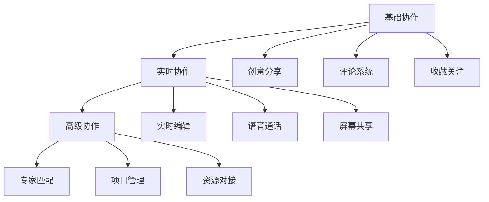
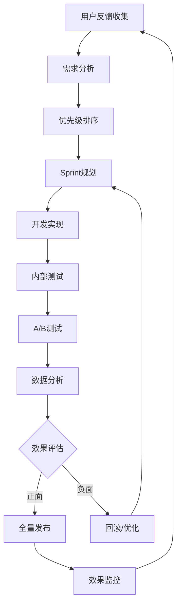

# 协作功能与商业化策略

## 🤝 协作功能设计

### 1. 协作需求分析

#### 用户协作场景
- **团队创意会议**: 多人实时讨论和完善创意
- **导师指导**: 经验丰富的创业者指导新手
- **投资人对接**: 创业者向投资人展示创意
- **跨领域合作**: 不同专业背景的人员协作
- **社区互助**: 用户之间的经验分享和互助

#### 协作功能优先级


### 2. 协作功能架构

#### 实时协作系统
```typescript
// 协作服务架构
interface CollaborationService {
  // 房间管理
  roomManager: {
    createRoom(ideaId: string, ownerId: string): Promise<Room>;
    joinRoom(roomId: string, userId: string): Promise<void>;
    leaveRoom(roomId: string, userId: string): Promise<void>;
    getRoomMembers(roomId: string): Promise<User[]>;
  };
  
  // 实时同步
  realtimeSync: {
    syncIdeaChanges(roomId: string, changes: IdeaChange[]): void;
    syncCursorPosition(roomId: string, cursor: CursorPosition): void;
    syncUserPresence(roomId: string, presence: UserPresence): void;
  };
  
  // 权限管理
  permissionManager: {
    setPermission(roomId: string, userId: string, permission: Permission): Promise<void>;
    checkPermission(roomId: string, userId: string, action: string): boolean;
    transferOwnership(roomId: string, newOwnerId: string): Promise<void>;
  };
}

// WebSocket实时通信
class RealtimeCollaboration {
  private ws: WebSocket;
  private roomId: string;
  private userId: string;
  
  constructor(roomId: string, userId: string) {
    this.roomId = roomId;
    this.userId = userId;
    this.initializeWebSocket();
  }
  
  private initializeWebSocket() {
    this.ws = new WebSocket(`wss://api.example.com/collab/${this.roomId}`);
    
    this.ws.onmessage = (event) => {
      const message = JSON.parse(event.data);
      this.handleMessage(message);
    };
    
    this.ws.onopen = () => {
      this.sendMessage({
        type: 'join',
        userId: this.userId,
        timestamp: Date.now()
      });
    };
  }
  
  // 发送创意变更
  sendIdeaChange(change: IdeaChange) {
    this.sendMessage({
      type: 'idea_change',
      change,
      userId: this.userId,
      timestamp: Date.now()
    });
  }
  
  // 发送光标位置
  sendCursorPosition(position: CursorPosition) {
    this.sendMessage({
      type: 'cursor_position',
      position,
      userId: this.userId,
      timestamp: Date.now()
    });
  }
  
  private handleMessage(message: CollabMessage) {
    switch (message.type) {
      case 'idea_change':
        this.applyIdeaChange(message.change);
        break;
      case 'cursor_position':
        this.updateUserCursor(message.userId, message.position);
        break;
      case 'user_joined':
        this.onUserJoined(message.user);
        break;
      case 'user_left':
        this.onUserLeft(message.userId);
        break;
    }
  }
}
```

#### 协作界面设计
```jsx
// 协作创意编辑器
const CollaborativeIdeaEditor = ({ ideaId, roomId }) => {
  const [idea, setIdea] = useState(null);
  const [collaborators, setCollaborators] = useState([]);
  const [isOwner, setIsOwner] = useState(false);
  const collaboration = useRealtimeCollaboration(roomId);
  
  return (
    <div className="flex h-screen bg-gray-50">
      {/* 主编辑区域 */}
      <div className="flex-1 flex flex-col">
        {/* 顶部工具栏 */}
        <div className="bg-white border-b px-6 py-4 flex items-center justify-between">
          <div className="flex items-center gap-4">
            <h1 className="text-xl font-semibold">{idea?.title}</h1>
            <div className="flex items-center gap-2">
              {collaborators.map(user => (
                <UserAvatar 
                  key={user.id} 
                  user={user} 
                  isOnline={user.isOnline}
                  cursor={user.cursor}
                />
              ))}
            </div>
          </div>
          
          <div className="flex items-center gap-2">
            <ShareButton ideaId={ideaId} />
            <InviteButton roomId={roomId} />
            <PermissionSelector 
              roomId={roomId} 
              isOwner={isOwner}
            />
          </div>
        </div>
        
        {/* 编辑器内容 */}
        <div className="flex-1 p-6">
          <CollaborativeEditor
            idea={idea}
            onChange={(changes) => collaboration.sendIdeaChange(changes)}
            onCursorMove={(position) => collaboration.sendCursorPosition(position)}
          />
        </div>
      </div>
      
      {/* 右侧面板 */}
      <div className="w-80 bg-white border-l flex flex-col">
        {/* 协作者列表 */}
        <div className="p-4 border-b">
          <h3 className="font-semibold mb-3">协作者 ({collaborators.length})</h3>
          <div className="space-y-2">
            {collaborators.map(user => (
              <CollaboratorItem 
                key={user.id} 
                user={user}
                isOwner={isOwner}
                onPermissionChange={(permission) => 
                  handlePermissionChange(user.id, permission)
                }
              />
            ))}
          </div>
        </div>
        
        {/* 实时聊天 */}
        <div className="flex-1 flex flex-col">
          <div className="p-4 border-b">
            <h3 className="font-semibold">讨论</h3>
          </div>
          <RealtimeChat roomId={roomId} />
        </div>
      </div>
    </div>
  );
};

// 用户头像组件
const UserAvatar = ({ user, isOnline, cursor }) => {
  return (
    <div className="relative">
      
      {cursor && (
        <div 
          className="absolute w-2 h-2 rounded-full"
          style={{ 
            backgroundColor: user.cursorColor,
            left: cursor.x,
            top: cursor.y
          }}
        />
      )}
    </div>
  );
};
```

### 3. 社区功能设计

#### 创意社区架构
```typescript
// 社区功能模块
interface CommunityFeatures {
  // 创意广场
  ideaMarketplace: {
    publishIdea(idea: BusinessIdea, visibility: 'public' | 'community'): Promise<void>;
    browseIdeas(filters: IdeaFilters): Promise<BusinessIdea[]>;
    searchIdeas(query: string): Promise<BusinessIdea[]>;
    trendingIdeas(): Promise<BusinessIdea[]>;
  };
  
  // 专家网络
  expertNetwork: {
    findExperts(domain: string): Promise<Expert[]>;
    requestMentorship(expertId: string, ideaId: string): Promise<void>;
    scheduleConsultation(expertId: string, timeSlot: TimeSlot): Promise<void>;
  };
  
  // 学习中心
  learningCenter: {
    getCourses(category: string): Promise<Course[]>;
    getResources(topic: string): Promise<Resource[]>;
    trackProgress(userId: string, courseId: string): Promise<Progress>;
  };
  
  // 活动系统
  eventSystem: {
    createEvent(event: CommunityEvent): Promise<void>;
    joinEvent(eventId: string, userId: string): Promise<void>;
    getUpcomingEvents(): Promise<CommunityEvent[]>;
  };
}
```

#### 社区界面设计
```jsx
// 创意社区首页
const CommunityHomepage = () => {
  return (
    <div className="max-w-7xl mx-auto px-4 py-8">
      {/* 顶部导航 */}
      <div className="flex items-center justify-between mb-8">
        <div className="flex items-center gap-6">
          <h1 className="text-2xl font-bold">创意社区</h1>
          <nav className="flex gap-4">
            <NavLink to="/community/trending">🔥 热门</NavLink>
            <NavLink to="/community/latest">🆕 最新</NavLink>
            <NavLink to="/community/experts">👨‍🏫 专家</NavLink>
            <NavLink to="/community/events">📅 活动</NavLink>
          </nav>
        </div>
        
        <div className="flex items-center gap-3">
          <SearchBar placeholder="搜索创意、专家、话题..." />
          <Button>发布创意</Button>
        </div>
      </div>
      
      {/* 主要内容区域 */}
      <div className="grid grid-cols-12 gap-8">
        {/* 左侧内容 */}
        <div className="col-span-8 space-y-6">
          {/* 精选创意 */}
          <section>
            <h2 className="text-xl font-semibold mb-4">🌟 精选创意</h2>
            <div className="grid grid-cols-2 gap-4">
              {featuredIdeas.map(idea => (
                <FeaturedIdeaCard key={idea.id} idea={idea} />
              ))}
            </div>
          </section>
          
          {/* 最新讨论 */}
          <section>
            <h2 className="text-xl font-semibold mb-4">💬 最新讨论</h2>
            <div className="space-y-4">
              {discussions.map(discussion => (
                <DiscussionCard key={discussion.id} discussion={discussion} />
              ))}
            </div>
          </section>
        </div>
        
        {/* 右侧边栏 */}
        <div className="col-span-4 space-y-6">
          {/* 今日专家 */}
          <section className="bg-white rounded-lg p-6 shadow-sm">
            <h3 className="font-semibold mb-4">👨‍🏫 今日专家</h3>
            <div className="space-y-3">
              {todayExperts.map(expert => (
                <ExpertCard key={expert.id} expert={expert} />
              ))}
            </div>
          </section>
          
          {/* 即将开始的活动 */}
          <section className="bg-white rounded-lg p-6 shadow-sm">
            <h3 className="font-semibold mb-4">📅 即将开始</h3>
            <div className="space-y-3">
              {upcomingEvents.map(event => (
                <EventCard key={event.id} event={event} />
              ))}
            </div>
          </section>
          
          {/* 学习推荐 */}
          <section className="bg-white rounded-lg p-6 shadow-sm">
            <h3 className="font-semibold mb-4">📚 推荐学习</h3>
            <div className="space-y-3">
              {recommendedCourses.map(course => (
                <CourseCard key={course.id} course={course} />
              ))}
            </div>
          </section>
        </div>
      </div>
    </div>
  );
};
```

## 💰 商业化策略

### 1. 商业模式设计

#### 多层次订阅模式
```typescript
interface SubscriptionTiers {
  free: {
    name: '免费版';
    price: 0;
    features: [
      '每月5次AI创意生成',
      '基础苏格拉底对话',
      '简单需求验证',
      '社区浏览权限'
    ];
    limitations: [
      '不支持协作功能',
      '无个性化推荐',
      '无专家咨询',
      '无数据导出'
    ];
  };
  
  pro: {
    name: '专业版';
    price: 29; // 月付
    features: [
      '无限AI创意生成',
      '高级对话模式',
      '深度需求分析',
      '个性化推荐',
      '协作功能(最多5人)',
      '数据导出',
      '优先客服支持'
    ];
    targetUsers: '个人创业者、小团队';
  };
  
  team: {
    name: '团队版';
    price: 99; // 月付
    features: [
      '专业版所有功能',
      '无限协作成员',
      '团队管理面板',
      '高级分析报告',
      'API访问权限',
      '专家咨询(每月2小时)',
      '定制化培训'
    ];
    targetUsers: '中小企业、创业团队';
  };
  
  enterprise: {
    name: '企业版';
    price: 'custom';
    features: [
      '团队版所有功能',
      '私有部署选项',
      '定制化开发',
      '专属客户经理',
      '无限专家咨询',
      '企业级安全',
      'SLA保障'
    ];
    targetUsers: '大型企业、投资机构';
  };
}
```

#### 增值服务模式
```typescript
interface ValueAddedServices {
  // 专家咨询服务
  expertConsultation: {
    pricing: {
      '30分钟咨询': 199,
      '1小时深度咨询': 399,
      '项目全程指导': 2999
    };
    experts: ExpertCategory[];
  };
  
  // 定制化服务
  customServices: {
    '商业计划书撰写': 1999,
    '市场调研报告': 2999,
    '竞品分析报告': 1499,
    '投资人对接': 4999
  };
  
  // 培训课程
  trainingCourses: {
    '创业基础课程': 299,
    '商业模式设计': 599,
    '融资实战指南': 899,
    '企业内训定制': 'custom'
  };
  
  // 数据服务
  dataServices: {
    '行业趋势报告': 199,
    '市场数据包': 399,
    '竞争情报': 599
  };
}
```

### 2. 收入模型分析

#### 收入预测模型
```typescript
class RevenueModel {
  // 用户增长预测
  calculateUserGrowth(months: number): UserGrowthProjection {
    const baseUsers = 1000; // 初始用户数
    const monthlyGrowthRate = 0.15; // 15%月增长率
    
    const projections = [];
    for (let month = 1; month <= months; month++) {
      const totalUsers = baseUsers * Math.pow(1 + monthlyGrowthRate, month);
      const freeUsers = totalUsers * 0.7; // 70%免费用户
      const proUsers = totalUsers * 0.25; // 25%专业版用户
      const teamUsers = totalUsers * 0.04; // 4%团队版用户
      const enterpriseUsers = totalUsers * 0.01; // 1%企业版用户
      
      projections.push({
        month,
        totalUsers,
        freeUsers,
        proUsers,
        teamUsers,
        enterpriseUsers
      });
    }
    
    return projections;
  }
  
  // 收入预测
  calculateRevenue(userProjections: UserGrowthProjection[]): RevenueProjection[] {
    return userProjections.map(projection => {
      const subscriptionRevenue = 
        projection.proUsers * 29 +
        projection.teamUsers * 99 +
        projection.enterpriseUsers * 500; // 企业版平均价格
      
      const serviceRevenue = 
        projection.totalUsers * 0.1 * 300; // 10%用户使用增值服务，平均300元
      
      const totalRevenue = subscriptionRevenue + serviceRevenue;
      
      return {
        month: projection.month,
        subscriptionRevenue,
        serviceRevenue,
        totalRevenue,
        arr: totalRevenue * 12 // 年度经常性收入
      };
    });
  }
}
```

#### 定价策略
```typescript
interface PricingStrategy {
  // 价格锚定策略
  priceAnchoring: {
    strategy: '将企业版设为最高价格锚点，突出团队版性价比';
    implementation: '在定价页面优先展示企业版，然后推荐团队版';
  };
  
  // 免费增值策略
  freemiumStrategy: {
    freeTrialPeriod: 14; // 14天免费试用
    conversionTactics: [
      '试用期结束前3天发送升级提醒',
      '展示高级功能的价值',
      '提供首月折扣优惠'
    ];
  };
  
  // 动态定价
  dynamicPricing: {
    factors: ['用户规模', '使用频率', '功能需求', '行业类型'];
    adjustmentRange: '±20%';
  };
  
  // 地区定价
  regionalPricing: {
    中国大陆: '基准价格';
    东南亚: '基准价格 × 0.7';
    欧美: '基准价格 × 1.2';
  };
}
```

### 3. 变现功能实现

#### 订阅管理系统
```typescript
// 订阅服务
class SubscriptionService {
  async createSubscription(userId: string, planId: string, paymentMethod: string) {
    const user = await this.getUserById(userId);
    const plan = await this.getPlanById(planId);
    
    // 创建订阅记录
    const subscription = await this.db.subscriptions.create({
      userId,
      planId,
      status: 'active',
      currentPeriodStart: new Date(),
      currentPeriodEnd: this.calculatePeriodEnd(plan.billingCycle),
      trialEnd: plan.trialDays ? this.calculateTrialEnd(plan.trialDays) : null
    });
    
    // 处理支付
    const payment = await this.paymentService.createPayment({
      amount: plan.price,
      currency: 'CNY',
      customerId: user.stripeCustomerId,
      paymentMethod
    });
    
    // 更新用户权限
    await this.updateUserPermissions(userId, plan.features);
    
    return subscription;
  }
  
  async handleSubscriptionRenewal(subscriptionId: string) {
    const subscription = await this.getSubscriptionById(subscriptionId);
    const plan = await this.getPlanById(subscription.planId);
    
    try {
      // 尝试续费
      const payment = await this.paymentService.chargeCustomer({
        customerId: subscription.userId,
        amount: plan.price,
        description: `${plan.name} 续费`
      });
      
      // 更新订阅期限
      await this.extendSubscription(subscriptionId, plan.billingCycle);
      
    } catch (error) {
      // 续费失败，降级到免费版
      await this.downgradeToFree(subscription.userId);
      await this.sendPaymentFailureNotification(subscription.userId);
    }
  }
}
```

#### 使用量计费系统
```typescript
// 使用量追踪
class UsageTracker {
  async trackAPIUsage(userId: string, endpoint: string, tokens: number) {
    const usage = await this.db.usage.create({
      userId,
      resourceType: 'api_call',
      endpoint,
      quantity: tokens,
      timestamp: new Date()
    });
    
    // 检查是否超出配额
    const monthlyUsage = await this.getMonthlyUsage(userId);
    const userPlan = await this.getUserPlan(userId);
    
    if (monthlyUsage.tokens > userPlan.tokenLimit) {
      await this.handleOverage(userId, monthlyUsage.tokens - userPlan.tokenLimit);
    }
    
    return usage;
  }
  
  async handleOverage(userId: string, overageTokens: number) {
    const user = await this.getUserById(userId);
    const overageCost = overageTokens * 0.001; // 每个token 0.001元
    
    if (user.autoPayOverage) {
      // 自动扣费
      await this.chargeOverage(userId, overageCost);
    } else {
      // 限制使用并通知用户
      await this.suspendAPIAccess(userId);
      await this.sendOverageNotification(userId, overageCost);
    }
  }
}
```

### 4. 支付集成

#### 多支付方式支持
```typescript
// 支付服务集成
class PaymentService {
  private providers: Map<string, PaymentProvider> = new Map();
  
  constructor() {
    // 支付宝
    this.providers.set('alipay', new AlipayProvider({
      appId: process.env.ALIPAY_APP_ID,
      privateKey: process.env.ALIPAY_PRIVATE_KEY
    }));
    
    // 微信支付
    this.providers.set('wechat', new WechatPayProvider({
      mchId: process.env.WECHAT_MCH_ID,
      apiKey: process.env.WECHAT_API_KEY
    }));
    
    // Stripe (国际支付)
    this.providers.set('stripe', new StripeProvider({
      secretKey: process.env.STRIPE_SECRET_KEY
    }));
  }
  
  async createPayment(paymentRequest: PaymentRequest): Promise<PaymentResult> {
    const provider = this.providers.get(paymentRequest.method);
    if (!provider) {
      throw new Error(`Unsupported payment method: ${paymentRequest.method}`);
    }
    
    try {
      const result = await provider.createPayment(paymentRequest);
      
      // 记录支付日志
      await this.logPayment({
        userId: paymentRequest.userId,
        amount: paymentRequest.amount,
        method: paymentRequest.method,
        status: 'pending',
        transactionId: result.transactionId
      });
      
      return result;
    } catch (error) {
      await this.handlePaymentError(paymentRequest, error);
      throw error;
    }
  }
  
  async handleWebhook(provider: string, payload: any): Promise<void> {
    const paymentProvider = this.providers.get(provider);
    const event = await paymentProvider.verifyWebhook(payload);
    
    switch (event.type) {
      case 'payment.succeeded':
        await this.handlePaymentSuccess(event.data);
        break;
      case 'payment.failed':
        await this.handlePaymentFailure(event.data);
        break;
      case 'subscription.cancelled':
        await this.handleSubscriptionCancellation(event.data);
        break;
    }
  }
}
```

## 📊 用户反馈与迭代机制

### 1. 反馈收集系统

#### 多渠道反馈收集
```typescript
interface FeedbackSystem {
  // 应用内反馈
  inAppFeedback: {
    quickRating: '1-5星快速评分';
    detailedFeedback: '详细反馈表单';
    featureRequest: '功能请求投票';
    bugReport: 'Bug报告系统';
  };
  
  // 用户访谈
  userInterviews: {
    scheduledInterviews: '定期用户访谈';
    exitInterviews: '流失用户访谈';
    featureValidation: '新功能验证访谈';
  };
  
  // 数据分析
  behaviorAnalytics: {
    userJourney: '用户行为路径分析';
    featureUsage: '功能使用统计';
    conversionFunnel: '转化漏斗分析';
    cohortAnalysis: '用户群组分析';
  };
  
  // 社区反馈
  communityFeedback: {
    forum: '用户论坛讨论';
    socialMedia: '社交媒体监听';
    customerSupport: '客服对话分析';
  };
}
```

#### 反馈处理流程
```typescript
class FeedbackProcessor {
  async processFeedback(feedback: UserFeedback): Promise<void> {
    // 1. 自动分类
    const category = await this.categorizeFeedback(feedback);
    
    // 2. 优先级评估
    const priority = this.calculatePriority(feedback, category);
    
    // 3. 分配处理团队
    const assignee = this.assignToTeam(category, priority);
    
    // 4. 创建工作项
    const workItem = await this.createWorkItem({
      type: category,
      priority,
      assignee,
      description: feedback.content,
      userId: feedback.userId,
      createdAt: new Date()
    });
    
    // 5. 通知用户
    await this.notifyUser(feedback.userId, {
      message: '感谢您的反馈，我们已收到并正在处理',
      trackingId: workItem.id
    });
  }
  
  private calculatePriority(feedback: UserFeedback, category: string): Priority {
    let score = 0;
    
    // 用户等级权重
    score += feedback.user.subscriptionTier === 'enterprise' ? 10 : 
             feedback.user.subscriptionTier === 'team' ? 7 :
             feedback.user.subscriptionTier === 'pro' ? 5 : 2;
    
    // 反馈类型权重
    score += category === 'bug' ? 8 :
             category === 'feature_request' ? 5 :
             category === 'improvement' ? 3 : 1;
    
    // 影响范围权重
    score += feedback.affectedUsers > 100 ? 10 :
             feedback.affectedUsers > 10 ? 5 : 1;
    
    return score >= 15 ? 'high' : score >= 8 ? 'medium' : 'low';
  }
}
```

### 2. A/B测试框架

#### 实验管理系统
```typescript
class ExperimentManager {
  private experiments: Map<string, Experiment> = new Map();
  
  async createExperiment(config: ExperimentConfig): Promise<Experiment> {
    const experiment: Experiment = {
      id: generateId(),
      name: config.name,
      description: config.description,
      variants: config.variants,
      trafficAllocation: config.trafficAllocation,
      targetAudience: config.targetAudience,
      metrics: config.metrics,
      status: 'draft',
      createdAt: new Date()
    };
    
    this.experiments.set(experiment.id, experiment);
    return experiment;
  }
  
  async startExperiment(experimentId: string): Promise<void> {
    const experiment = this.experiments.get(experimentId);
    if (!experiment) throw new Error('Experiment not found');
    
    experiment.status = 'running';
    experiment.startedAt = new Date();
    
    // 初始化用户分组
    await this.initializeUserSegmentation(experiment);
  }
  
  getVariantForUser(experimentId: string, userId: string): string {
    const experiment = this.experiments.get(experimentId);
    if (!experiment || experiment.status !== 'running') {
      return 'control';
    }
    
    // 基于用户ID的一致性哈希分组
    const hash = this.hashUserId(userId + experimentId);
    const bucket = hash % 100;
    
    let cumulativeTraffic = 0;
    for (const [variant, traffic] of Object.entries(experiment.trafficAllocation)) {
      cumulativeTraffic += traffic;
      if (bucket < cumulativeTraffic) {
        return variant;
      }
    }
    
    return 'control';
  }
  
  async recordMetric(experimentId: string, userId: string, metric: string, value: number): Promise<void> {
    const variant = this.getVariantForUser(experimentId, userId);
    
    await this.db.experimentMetrics.create({
      experimentId,
      userId,
      variant,
      metric,
      value,
      timestamp: new Date()
    });
  }
}
```

#### 实验结果分析
```typescript
class ExperimentAnalyzer {
  async analyzeExperiment(experimentId: string): Promise<ExperimentResults> {
    const experiment = await this.getExperiment(experimentId);
    const metrics = await this.getExperimentMetrics(experimentId);
    
    const results: ExperimentResults = {
      experimentId,
      variants: {},
      statisticalSignificance: {},
      recommendations: []
    };
    
    // 分析每个变体的表现
    for (const variant of experiment.variants) {
      const variantMetrics = metrics.filter(m => m.variant === variant);
      results.variants[variant] = this.calculateVariantStats(variantMetrics);
    }
    
    // 计算统计显著性
    for (const metric of experiment.metrics) {
      results.statisticalSignificance[metric] = 
        this.calculateSignificance(results.variants, metric);
    }
    
    // 生成建议
    results.recommendations = this.generateRecommendations(results);
    
    return results;
  }
  
  private calculateSignificance(variants: any, metric: string): SignificanceTest {
    const control = variants.control[metric];
    const treatment = variants.treatment[metric];
    
    // 执行t检验
    const tStat = this.tTest(control.values, treatment.values);
    const pValue = this.calculatePValue(tStat, control.count + treatment.count - 2);
    
    return {
      pValue,
      isSignificant: pValue < 0.05,
      confidenceInterval: this.calculateConfidenceInterval(control, treatment),
      effect: (treatment.mean - control.mean) / control.mean
    };
  }
}
```

### 3. 产品迭代流程

#### 敏捷开发流程


#### 发布管理系统
```typescript
class ReleaseManager {
  async planRelease(version: string, features: Feature[]): Promise<ReleasePlan> {
    const plan: ReleasePlan = {
      version,
      features,
      rolloutStrategy: this.determineRolloutStrategy(features),
      timeline: this.calculateTimeline(features),
      risks: this.assessRisks(features),
      rollbackPlan: this.createRollbackPlan(features)
    };
    
    return plan;
  }
  
  async executeGradualRollout(releaseId: string): Promise<void> {
    const release = await this.getRelease(releaseId);
    
    // 阶段1: 内部用户 (1%)
    await this.rolloutToSegment(releaseId, 'internal', 0.01);
    await this.monitorMetrics(releaseId, '24h');
    
    // 阶段2: 早期采用者 (5%)
    if (this.isRolloutHealthy(releaseId)) {
      await this.rolloutToSegment(releaseId, 'early_adopters', 0.05);
      await this.monitorMetrics(releaseId, '48h');
    }
    
    // 阶段3: 付费用户 (25%)
    if (this.isRolloutHealthy(releaseId)) {
      await this.rolloutToSegment(releaseId, 'paid_users', 0.25);
      await this.monitorMetrics(releaseId, '72h');
    }
    
    // 阶段4: 全量发布 (100%)
    if (this.isRolloutHealthy(releaseId)) {
      await this.rolloutToSegment(releaseId, 'all_users', 1.0);
    }
  }
  
  private isRolloutHealthy(releaseId: string): boolean {
    const metrics = this.getRolloutMetrics(releaseId);
    
    return (
      metrics.errorRate < 0.01 && // 错误率 < 1%
      metrics.crashRate < 0.001 && // 崩溃率 < 0.1%
      metrics.userSatisfaction > 4.0 && // 用户满意度 > 4.0
      metrics.performanceRegression < 0.1 // 性能回归 < 10%
    );
  }
}
```

---

*本协作功能与商业化策略文档提供了完整的产品生态设计，从技术实现到商业模式，从用户协作到收入增长。建议根据产品发展阶段逐步实施相关功能。*