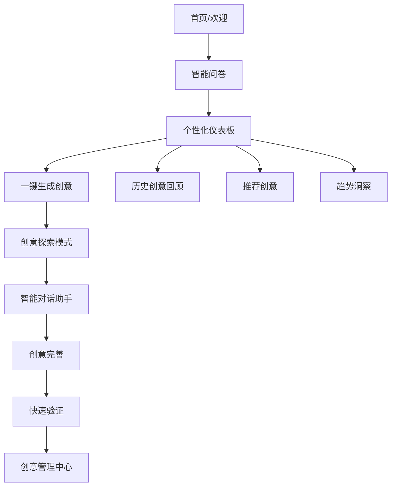

# AI商业创意生成器 - 产品分析与重构方案

## 📊 当前产品分析

### 产品概述
- **产品名称**: AI Business Idea Generator
- **核心功能**: 基于AI的商业创意生成、苏格拉底式对话精炼、需求验证
- **技术栈**: Next.js 14 + TypeScript + Tailwind CSS + shadcn/ui
- **支持模型**: DeepSeek、Qwen、GPT-4、Claude等多种AI模型

### 当前架构优势
1. **技术架构现代化**: 使用Next.js 14 App Router，TypeScript保证类型安全
2. **多模型支持**: 统一接口支持多种AI模型，给用户选择权
3. **工作流设计**: 三步式工作流（生成→精炼→验证）逻辑清晰
4. **响应式设计**: 良好的移动端适配
5. **组件化架构**: 良好的代码组织和复用性

### 🚨 关键痛点分析

#### 1. 用户体验痛点
- **操作复杂性高**: 三步工作流虽然逻辑清晰，但对新用户来说学习成本较高
- **缺乏引导**: 没有新手引导和帮助系统
- **流程割裂**: 各步骤间缺乏平滑过渡，用户容易迷失
- **反馈不及时**: 缺乏实时的进度反馈和状态提示
- **个性化缺失**: 没有基于用户历史的个性化推荐

#### 2. 功能体验痛点
- **创意展示单调**: 创意卡片信息密度高但缺乏视觉吸引力
- **对话体验僵硬**: 苏格拉底式对话缺乏情感化和个性化
- **验证结果抽象**: 需求验证结果专业但不够直观
- **缺乏保存机制**: 用户无法有效管理和回顾历史创意

#### 3. 交互设计痛点
- **信息过载**: 单页面信息量过大，用户认知负担重
- **缺乏渐进式披露**: 所有功能一次性展示，没有层次感
- **反馈机制不足**: 缺乏用户操作的即时反馈
- **导航不清晰**: 用户不知道当前位置和下一步操作

## 🎯 重构目标与策略

### 核心目标
1. **简化操作流程**: 将复杂的三步工作流简化为更直观的体验
2. **提升交互流畅度**: 减少页面跳转，增加平滑过渡动画
3. **增强个性化**: 基于用户行为和偏好提供智能推荐
4. **优化信息架构**: 重新组织信息层次，降低认知负担

### 设计原则
1. **渐进式披露**: 按需展示信息，避免一次性信息过载
2. **即时反馈**: 每个操作都有明确的视觉和交互反馈
3. **智能引导**: 主动帮助用户完成任务，减少思考成本
4. **情感化设计**: 增加趣味性和人性化元素

## 🔄 新产品架构设计

### 1. 重新设计的用户流程



### 2. 新的信息架构

#### 主导航结构
```
├── 🏠 首页
│   ├── 个人仪表板
│   ├── 快速生成
│   └── 今日推荐
├── 💡 创意工坊
│   ├── 智能生成
│   ├── 创意探索
│   └── 灵感库
├── 🤖 AI助手
│   ├── 苏格拉底对话
│   ├── 创意分析师
│   └── 市场顾问
├── 📊 我的创意
│   ├── 创意收藏夹
│   ├── 项目管理
│   └── 进度追踪
└── ⚙️ 设置
    ├── 个人偏好
    ├── AI模型选择
    └── 通知设置
```

## 🎨 用户体验重构方案

### 1. 首次使用体验优化

#### 智能入门问卷
替代复杂的表单填写，设计5-7个智能问题：
- 您的专业背景是？（技术/商业/设计/其他）
- 您对哪些行业感兴趣？（多选，带图标）
- 您的创业经验如何？（新手/有经验/连续创业者）
- 您希望解决什么类型的问题？（效率/娱乐/教育/健康等）
- 您的风险偏好？（稳健/平衡/激进）

#### 个性化欢迎体验
- 基于问卷结果生成个人创意画像
- 推荐3-5个最适合的创意方向
- 展示个性化的成功案例

### 2. 创意生成体验重构

#### 从"工作流"到"创意工坊"
- **当前**: 严格的三步工作流
- **重构**: 灵活的创意工坊模式

#### 新的生成界面设计
```
┌─────────────────────────────────────┐
│  🎯 今天想探索什么创意？              │
│  ┌─────────────────────────────────┐ │
│  │ [智能输入框 - 支持语音输入]        │ │
│  └─────────────────────────────────┘ │
│                                     │
│  💡 快速启发                         │
│  [趋势机会] [随机灵感] [细分市场]     │
│                                     │
│  🔥 基于您的兴趣推荐                 │
│  [AI+教育] [可持续发展] [健康科技]   │
└─────────────────────────────────────┘
```

#### 创意展示优化
- **卡片式布局**: 更大的视觉空间，突出核心信息
- **渐进式展开**: 点击查看详情，避免信息过载
- **智能标签**: 自动生成行业、难度、市场规模等标签
- **相似度推荐**: "您可能还喜欢"相关创意

### 3. 对话体验人性化

#### AI助手人格化
- **创意导师**: 苏格拉底式提问，帮助深化思考
- **市场分析师**: 专业的市场和竞争分析
- **技术顾问**: 实现可行性和技术路径建议

#### 对话界面优化
- **情境化开场**: 根据创意内容定制开场白
- **智能建议**: 提供3-4个预设回答选项
- **进度可视化**: 显示对话深度和完成度
- **随时保存**: 支持对话中途保存和继续

### 4. 验证结果可视化

#### 直观的评分系统
- **雷达图**: 多维度评分可视化
- **对比分析**: 与同类创意的对比
- **风险提示**: 明确的风险点和建议
- **行动清单**: 可操作的下一步建议

## 🤖 个性化与智能化功能

### 1. 智能推荐系统

#### 用户画像构建
```typescript
interface UserProfile {
  // 基础信息
  background: 'tech' | 'business' | 'design' | 'other';
  experience: 'beginner' | 'intermediate' | 'expert';
  
  // 兴趣偏好
  industries: string[];
  problemTypes: string[];
  riskTolerance: 'low' | 'medium' | 'high';
  
  // 行为数据
  generationHistory: GenerationRecord[];
  favoriteIdeas: BusinessIdea[];
  chatPatterns: ChatAnalytics;
  
  // 动态偏好
  recentFocus: string[];
  successPatterns: Pattern[];
}
```

#### 推荐算法设计
1. **协同过滤**: 基于相似用户的创意偏好
2. **内容推荐**: 基于用户历史兴趣的相关创意
3. **趋势推荐**: 结合市场热点和用户偏好
4. **多样性保证**: 避免推荐过于单一

### 2. 智能辅助功能

#### 创意补全助手
- **自动标签**: 智能识别创意的行业、类型、难度
- **市场洞察**: 实时获取相关市场数据和趋势
- **竞品分析**: 自动搜索和分析类似产品
- **可行性评估**: 基于技术和市场因素的初步评估

#### 智能提醒系统
- **创意跟进**: 提醒用户完善未完成的创意
- **市场变化**: 推送相关行业的重要变化
- **学习建议**: 基于创意方向推荐学习资源

### 3. 个性化界面

#### 自适应布局
- **偏好记忆**: 记住用户的界面偏好设置
- **快捷操作**: 基于使用频率调整功能位置
- **主题适配**: 支持多种视觉主题和色彩方案

## 📱 交互设计优化

### 1. 微交互设计

#### 反馈动画
- **加载状态**: 有趣的AI思考动画
- **成功反馈**: 庆祝式的完成动画
- **错误处理**: 友好的错误提示和恢复建议
- **进度指示**: 清晰的进度条和步骤指示

#### 手势支持
- **滑动操作**: 左滑收藏，右滑分享
- **长按菜单**: 快速操作菜单
- **拖拽排序**: 创意优先级调整

### 2. 响应式优化

#### 移动端优先设计
- **单手操作**: 重要按钮在拇指可达区域
- **简化导航**: 底部标签栏导航
- **语音输入**: 支持语音描述创意需求
- **离线支持**: 关键功能支持离线使用

### 3. 无障碍设计

#### 包容性设计
- **键盘导航**: 完整的键盘操作支持
- **屏幕阅读器**: 语义化的HTML和ARIA标签
- **色彩对比**: 符合WCAG标准的色彩对比度
- **字体缩放**: 支持系统字体大小设置

## 🔧 技术架构重构建议

### 1. 前端架构优化

#### 状态管理重构
```typescript
// 新的状态管理架构
interface AppState {
  user: UserState;
  ideas: IdeasState;
  chat: ChatState;
  ui: UIState;
  cache: CacheState;
}

// 使用Zustand替代复杂的Context
const useAppStore = create<AppState>((set, get) => ({
  // 状态和操作定义
}));
```

#### 性能优化策略
- **代码分割**: 按路由和功能模块分割
- **懒加载**: 非关键组件延迟加载
- **缓存策略**: 智能的数据缓存和更新
- **预加载**: 预测用户行为，提前加载数据

### 2. 后端服务重构

#### 微服务架构
```
┌─────────────────┐  ┌─────────────────┐  ┌─────────────────┐
│   用户服务      │  │   创意服务      │  │   AI服务        │
│   - 用户画像    │  │   - 创意生成    │  │   - 模型管理    │
│   - 偏好管理    │  │   - 创意存储    │  │   - 对话管理    │
│   - 推荐算法    │  │   - 搜索索引    │  │   - 结果缓存    │
└─────────────────┘  └─────────────────┘  └─────────────────┘
```

#### 数据库设计优化
```sql
-- 用户表增强
CREATE TABLE users (
  id UUID PRIMARY KEY,
  profile JSONB, -- 用户画像
  preferences JSONB, -- 偏好设置
  created_at TIMESTAMP,
  updated_at TIMESTAMP
);

-- 创意表优化
CREATE TABLE ideas (
  id UUID PRIMARY KEY,
  user_id UUID REFERENCES users(id),
  content JSONB, -- 创意内容
  metadata JSONB, -- 标签、评分等
  status VARCHAR(20), -- draft, refined, validated
  created_at TIMESTAMP
);

-- 交互记录表
CREATE TABLE interactions (
  id UUID PRIMARY KEY,
  user_id UUID REFERENCES users(id),
  idea_id UUID REFERENCES ideas(id),
  type VARCHAR(50), -- view, like, share, chat
  data JSONB,
  created_at TIMESTAMP
);
```

### 3. AI服务优化

#### 智能路由系统
```typescript
class AIRouter {
  // 根据任务类型和用户偏好选择最佳模型
  selectModel(task: AITask, userProfile: UserProfile): ModelConfig {
    // 智能模型选择逻辑
  }
  
  // 负载均衡和故障转移
  routeRequest(request: AIRequest): Promise<AIResponse> {
    // 路由逻辑
  }
}
```

#### 缓存和优化
- **结果缓存**: 相似请求结果复用
- **模型预热**: 常用模型保持热启动状态
- **批处理**: 合并相似请求提高效率

## 📊 数据驱动的产品改进

### 1. 关键指标体系

#### 用户体验指标
- **任务完成率**: 完整走完流程的用户比例
- **操作效率**: 平均完成时间和点击次数
- **用户满意度**: NPS评分和反馈质量
- **功能使用率**: 各功能模块的使用频率

#### 产品价值指标
- **创意质量**: 用户对生成创意的评分
- **个性化效果**: 推荐创意的点击率和收藏率
- **用户粘性**: 日活、周活、月活用户数
- **转化效果**: 从创意到实际行动的转化率

### 2. A/B测试框架

#### 测试优先级
1. **首页布局**: 不同的信息架构对用户行为的影响
2. **生成流程**: 简化流程vs详细流程的效果对比
3. **推荐算法**: 不同推荐策略的效果评估
4. **交互设计**: 不同交互模式的用户偏好

### 3. 用户反馈循环

#### 反馈收集机制
- **隐式反馈**: 用户行为数据自动收集
- **显式反馈**: 评分、评论、建议收集
- **定性研究**: 用户访谈和可用性测试
- **社区反馈**: 用户社区的讨论和建议

## 🚀 实施路线图

### Phase 1: 基础体验优化 (4-6周)
- [ ] 重构首页和导航结构
- [ ] 优化创意生成流程
- [ ] 实现基础的用户偏好系统
- [ ] 改进移动端体验

### Phase 2: 智能化功能 (6-8周)
- [ ] 实现用户画像系统
- [ ] 开发智能推荐算法
- [ ] 优化AI对话体验
- [ ] 增加个性化界面

### Phase 3: 高级功能 (8-10周)
- [ ] 实现创意管理中心
- [ ] 开发协作功能
- [ ] 增加数据分析面板
- [ ] 完善反馈系统

### Phase 4: 生态完善 (持续)
- [ ] 社区功能开发
- [ ] 第三方集成
- [ ] 高级分析功能
- [ ] 商业化功能

## 💡 创新功能建议

### 1. AI创意伙伴
- **虚拟角色**: 给AI助手设计人格和形象
- **情感智能**: 识别用户情绪，调整对话风格
- **学习能力**: AI记住用户偏好，越用越懂用户

### 2. 创意社区
- **创意分享**: 用户可以分享和讨论创意
- **协作功能**: 多人共同完善一个创意
- **专家点评**: 邀请行业专家点评创意

### 3. 实战工具
- **商业计划书生成**: 基于创意自动生成BP模板
- **竞品分析工具**: 自动搜索和分析竞争对手
- **市场验证工具**: 集成问卷调研和用户访谈工具

### 4. 学习成长
- **创业课程**: 基于用户创意推荐相关课程
- **案例库**: 成功创业案例的深度分析
- **导师匹配**: 连接用户与行业导师

## 📈 成功指标定义

### 短期目标 (3个月)
- 用户完成率提升50%
- 平均使用时长增加30%
- 用户满意度达到4.5/5
- 移动端使用率达到60%

### 中期目标 (6个月)
- 月活用户增长100%
- 创意质量评分提升40%
- 推荐点击率达到25%
- 用户留存率达到70%

### 长期目标 (12个月)
- 成为创意生成领域的领导产品
- 建立活跃的用户社区
- 实现可持续的商业模式
- 获得行业认可和奖项

---

*本方案基于当前产品深度分析制定，重点关注用户体验优化、个性化功能和技术架构升级。建议按阶段实施，持续收集用户反馈并迭代优化。*