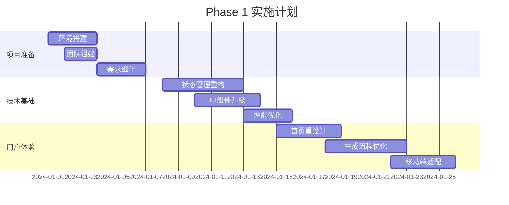
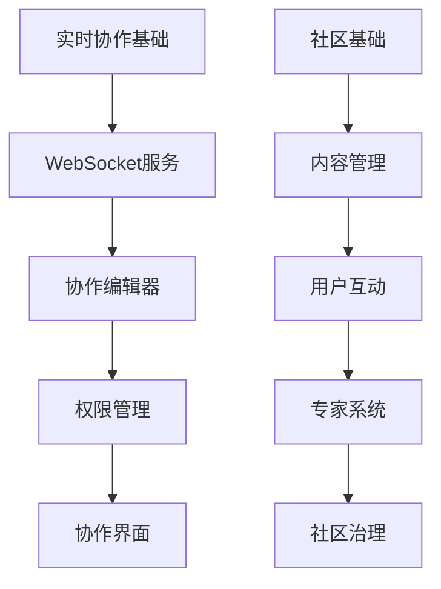
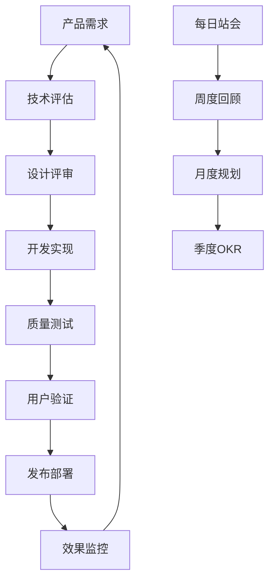
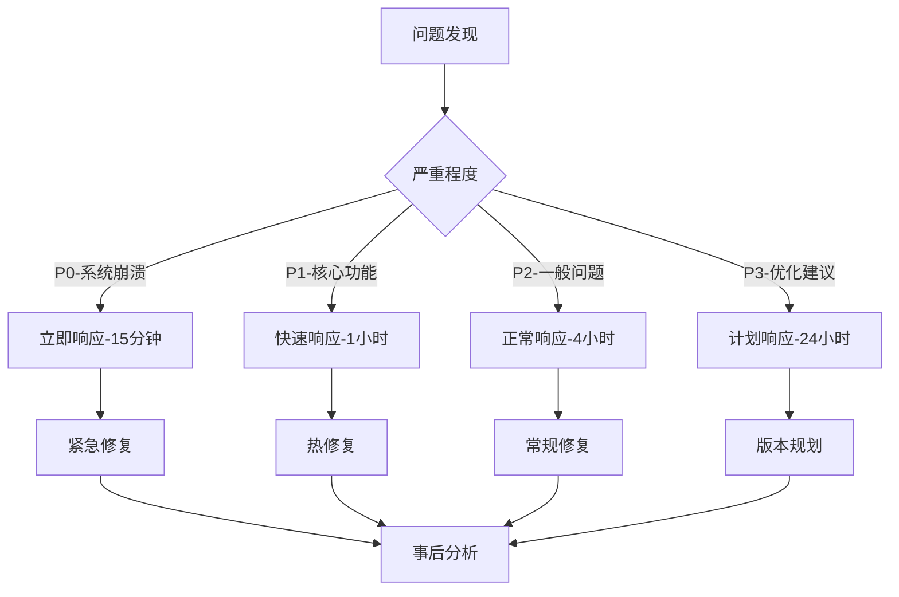

# 产品路线图与实施计划

## 🎯 总体战略目标

### 短期目标 (3-6个月)
- **用户体验显著提升**: 操作流程简化50%，用户满意度达到4.5/5
- **技术架构现代化**: 完成核心架构重构，性能提升30%
- **用户增长**: 月活用户增长100%，付费转化率达到15%
- **产品差异化**: 建立个性化推荐和智能对话的竞争优势

### 中期目标 (6-12个月)
- **生态建设**: 建立活跃的用户社区和专家网络
- **商业化成功**: 实现月收入10万元，年度经常性收入100万元
- **市场地位**: 成为中文创意生成工具的领导品牌
- **功能完善**: 实现协作、分析、导出等完整功能闭环

### 长期目标 (12-24个月)
- **平台化发展**: 开放API，支持第三方集成和插件生态
- **国际化扩展**: 进入东南亚和欧美市场
- **AI能力升级**: 集成最新的AI模型和技术
- **企业服务**: 建立完整的B2B服务体系

## 📅 详细实施路线图

### Phase 1: 基础体验优化 (Week 1-6)

#### Week 1-2: 项目准备与环境搭建


**具体任务清单:**
- [ ] **环境配置**
  - [ ] 升级Next.js到最新版本
  - [ ] 配置Zustand + React Query
  - [ ] 设置开发、测试、生产环境
  - [ ] 配置CI/CD流水线

- [ ] **状态管理重构**
  - [ ] 创建Zustand stores
  - [ ] 实现React Query hooks
  - [ ] 迁移现有Context逻辑
  - [ ] 性能测试和优化

- [ ] **UI/UX优化**
  - [ ] 实现新的设计系统
  - [ ] 重构首页布局
  - [ ] 优化创意生成流程
  - [ ] 改进移动端体验

#### Week 3-4: 核心功能优化
**重点任务:**
- [ ] **智能输入系统**
  - [ ] 实现语音输入功能
  - [ ] 添加智能提示和补全
  - [ ] 优化输入验证和错误处理

- [ ] **创意展示优化**
  - [ ] 重设计创意卡片
  - [ ] 实现渐进式加载
  - [ ] 添加交互动画效果

- [ ] **对话体验提升**
  - [ ] 优化AI对话界面
  - [ ] 添加智能建议功能
  - [ ] 实现对话历史管理

#### Week 5-6: 测试与发布
**质量保证:**
- [ ] **全面测试**
  - [ ] 单元测试覆盖率达到80%
  - [ ] 集成测试和E2E测试
  - [ ] 性能测试和压力测试
  - [ ] 用户验收测试

- [ ] **发布准备**
  - [ ] 生产环境部署
  - [ ] 监控和告警配置
  - [ ] 用户数据迁移
  - [ ] 发布文档和培训

### Phase 2: 智能化与个性化 (Week 7-14)

#### Week 7-9: 用户系统与个性化
```typescript
// 实施优先级
const phase2Priorities = {
  week7: {
    focus: '用户认证与画像系统',
    deliverables: [
      '用户注册登录系统',
      '基础用户画像构建',
      '偏好设置界面'
    ]
  },
  
  week8: {
    focus: '智能推荐算法',
    deliverables: [
      '推荐引擎开发',
      '协同过滤算法',
      '内容推荐系统'
    ]
  },
  
  week9: {
    focus: '个性化界面',
    deliverables: [
      '自适应布局系统',
      '个性化仪表板',
      '智能快捷操作'
    ]
  }
};
```

**详细任务:**
- [ ] **用户系统建设**
  - [ ] 实现JWT认证系统
  - [ ] 设计用户数据库结构
  - [ ] 开发用户注册/登录流程
  - [ ] 实现社交登录集成

- [ ] **个性化推荐**
  - [ ] 构建用户行为追踪系统
  - [ ] 开发推荐算法引擎
  - [ ] 实现实时推荐更新
  - [ ] A/B测试推荐效果

#### Week 10-12: AI能力增强
**AI服务优化:**
- [ ] **智能路由系统**
  - [ ] 实现多模型负载均衡
  - [ ] 开发智能模型选择
  - [ ] 优化API调用成本
  - [ ] 实现故障转移机制

- [ ] **对话智能化**
  - [ ] 增强苏格拉底式对话
  - [ ] 实现上下文理解
  - [ ] 添加情感分析功能
  - [ ] 优化对话连贯性

#### Week 13-14: 数据分析与优化
**分析系统建设:**
- [ ] **用户行为分析**
  - [ ] 实现事件追踪系统
  - [ ] 构建用户行为漏斗
  - [ ] 开发实时分析面板
  - [ ] 设置关键指标监控

### Phase 3: 协作与社区功能 (Week 15-22)

#### Week 15-17: 协作功能开发


**协作功能实现:**
- [ ] **实时协作引擎**
  - [ ] WebSocket服务搭建
  - [ ] 实时同步算法
  - [ ] 冲突解决机制
  - [ ] 协作状态管理

- [ ] **协作界面设计**
  - [ ] 多用户编辑界面
  - [ ] 实时光标显示
  - [ ] 协作者管理面板
  - [ ] 权限控制系统

#### Week 18-20: 社区功能建设
**社区平台开发:**
- [ ] **内容管理系统**
  - [ ] 创意发布与展示
  - [ ] 内容分类和标签
  - [ ] 搜索和筛选功能
  - [ ] 内容审核机制

- [ ] **用户互动功能**
  - [ ] 评论和点赞系统
  - [ ] 用户关注和粉丝
  - [ ] 私信和通知
  - [ ] 用户等级和徽章

#### Week 21-22: 专家网络与活动
**专家服务系统:**
- [ ] **专家认证体系**
  - [ ] 专家申请和审核
  - [ ] 专业能力评估
  - [ ] 专家等级划分
  - [ ] 服务质量监控

- [ ] **咨询服务平台**
  - [ ] 预约和排期系统
  - [ ] 在线咨询工具
  - [ ] 服务评价体系
  - [ ] 费用结算系统

### Phase 4: 商业化与增长 (Week 23-30)

#### Week 23-25: 订阅系统开发
**商业化基础设施:**
- [ ] **订阅管理系统**
  - [ ] 多层次订阅计划
  - [ ] 支付集成(支付宝/微信/Stripe)
  - [ ] 订阅生命周期管理
  - [ ] 计费和发票系统

- [ ] **功能权限控制**
  - [ ] 基于订阅的功能限制
  - [ ] 使用量监控和计费
  - [ ] 超额使用处理
  - [ ] 降级和升级流程

#### Week 26-28: 增值服务开发
**服务产品化:**
- [ ] **专业服务平台**
  - [ ] 商业计划书生成
  - [ ] 市场调研报告
  - [ ] 竞品分析服务
  - [ ] 投资人对接平台

- [ ] **培训课程系统**
  - [ ] 在线课程平台
  - [ ] 视频直播功能
  - [ ] 学习进度追踪
  - [ ] 证书和认证

#### Week 29-30: 营销与推广
**增长策略实施:**
- [ ] **营销自动化**
  - [ ] 邮件营销系统
  - [ ] 用户生命周期管理
  - [ ] 推荐奖励计划
  - [ ] 内容营销平台

## 📊 关键指标与里程碑

### 技术指标
```typescript
interface TechnicalKPIs {
  performance: {
    pageLoadTime: '< 2秒';
    apiResponseTime: '< 500ms';
    uptime: '> 99.9%';
    errorRate: '< 0.1%';
  };
  
  scalability: {
    concurrentUsers: '10,000+';
    dailyAPIRequests: '1,000,000+';
    dataStorage: '100TB+';
    globalCDN: '5个节点';
  };
  
  security: {
    dataEncryption: 'AES-256';
    apiSecurity: 'OAuth 2.0 + JWT';
    compliance: 'GDPR + 网络安全法';
    backupRecovery: 'RTO < 1小时';
  };
}
```

### 产品指标
```typescript
interface ProductKPIs {
  userExperience: {
    taskCompletionRate: '> 85%';
    userSatisfactionScore: '> 4.5/5';
    featureAdoptionRate: '> 60%';
    supportTicketVolume: '< 2%';
  };
  
  engagement: {
    dailyActiveUsers: '增长20%/月';
    sessionDuration: '> 15分钟';
    returnUserRate: '> 70%';
    featureUsageDepth: '> 3个功能/会话';
  };
  
  conversion: {
    signupConversionRate: '> 25%';
    trialToPaidConversion: '> 15%';
    monthlyChurnRate: '< 5%';
    upsellRate: '> 20%';
  };
}
```

### 商业指标
```typescript
interface BusinessKPIs {
  revenue: {
    monthlyRecurringRevenue: '目标: 100万元/年';
    averageRevenuePerUser: '> 200元/月';
    customerLifetimeValue: '> 2000元';
    paybackPeriod: '< 6个月';
  };
  
  growth: {
    userGrowthRate: '15%/月';
    revenueGrowthRate: '20%/月';
    marketShare: '中文市场前3';
    brandAwareness: '行业知名度前5';
  };
  
  efficiency: {
    customerAcquisitionCost: '< 100元';
    salesConversionRate: '> 10%';
    supportCostPerUser: '< 20元/月';
    operatingMargin: '> 30%';
  };
}
```

## 🎯 里程碑检查点

### Milestone 1: 基础体验优化完成 (Week 6)
**成功标准:**
- [ ] 新用户完成率提升50%
- [ ] 页面加载时间 < 2秒
- [ ] 移动端体验评分 > 4.0
- [ ] 核心功能无重大Bug

**验收标准:**
- [ ] 通过所有自动化测试
- [ ] 用户验收测试通过率 > 95%
- [ ] 性能测试达标
- [ ] 安全测试通过

### Milestone 2: 智能化功能上线 (Week 14)
**成功标准:**
- [ ] 个性化推荐点击率 > 25%
- [ ] AI对话满意度 > 4.2
- [ ] 用户留存率提升30%
- [ ] 功能使用深度增加40%

**关键功能验证:**
- [ ] 推荐算法准确性测试
- [ ] 个性化界面适配测试
- [ ] AI服务稳定性测试
- [ ] 用户画像准确性验证

### Milestone 3: 协作社区建成 (Week 22)
**成功标准:**
- [ ] 日活跃协作会话 > 100
- [ ] 社区内容发布量 > 50/天
- [ ] 专家响应时间 < 2小时
- [ ] 用户互动率 > 15%

**社区健康指标:**
- [ ] 内容质量评分 > 4.0
- [ ] 用户举报处理时间 < 1小时
- [ ] 专家服务满意度 > 4.5
- [ ] 社区活跃度持续增长

### Milestone 4: 商业化成功 (Week 30)
**成功标准:**
- [ ] 月收入达到10万元
- [ ] 付费用户转化率 > 15%
- [ ] 客户生命周期价值 > 2000元
- [ ] 月度净收入增长率 > 20%

**商业化验证:**
- [ ] 订阅系统稳定运行
- [ ] 支付成功率 > 99%
- [ ] 客户满意度 > 4.3
- [ ] 续费率 > 80%

## 🚀 实施保障措施

### 1. 团队组织架构

#### 核心团队配置
```typescript
interface TeamStructure {
  productTeam: {
    productManager: 1; // 产品经理
    uxDesigner: 1; // UX设计师
    uiDesigner: 1; // UI设计师
  };
  
  engineeringTeam: {
    techLead: 1; // 技术负责人
    frontendDevelopers: 2; // 前端开发
    backendDevelopers: 2; // 后端开发
    aiEngineer: 1; // AI工程师
    devopsEngineer: 1; // DevOps工程师
  };
  
  businessTeam: {
    businessDeveloper: 1; // 商务拓展
    marketingSpecialist: 1; // 市场营销
    customerSuccess: 1; // 客户成功
  };
  
  qualityTeam: {
    qaEngineer: 1; // 测试工程师
    dataAnalyst: 1; // 数据分析师
  };
}
```

#### 协作流程设计


### 2. 风险管理策略

#### 技术风险控制
```typescript
interface RiskMitigation {
  technicalRisks: {
    performanceBottlenecks: {
      risk: '高并发下系统性能下降';
      mitigation: [
        '提前进行压力测试',
        '实施渐进式发布',
        '准备快速扩容方案',
        '建立性能监控告警'
      ];
      contingency: '紧急降级和限流机制';
    };
    
    dataLoss: {
      risk: '用户数据丢失或损坏';
      mitigation: [
        '多重数据备份策略',
        '实时数据同步',
        '定期备份验证',
        '灾难恢复演练'
      ];
      contingency: '数据恢复和用户补偿方案';
    };
    
    aiServiceFailure: {
      risk: 'AI服务不可用或质量下降';
      mitigation: [
        '多供应商策略',
        '服务降级机制',
        '质量监控系统',
        '用户反馈快速响应'
      ];
      contingency: '手动服务和退款机制';
    };
  };
  
  businessRisks: {
    marketCompetition: {
      risk: '竞争对手推出类似产品';
      mitigation: [
        '建立技术护城河',
        '加强用户粘性',
        '快速功能迭代',
        '品牌建设投入'
      ];
      contingency: '差异化定位和价格策略调整';
    };
    
    regulatoryChanges: {
      risk: 'AI相关法规政策变化';
      mitigation: [
        '密切关注政策动向',
        '建立合规体系',
        '法律顾问支持',
        '行业协会参与'
      ];
      contingency: '快速合规调整方案';
    };
  };
}
```

### 3. 质量保证体系

#### 测试策略
```typescript
interface QualityAssurance {
  testingStrategy: {
    unitTesting: {
      coverage: '> 80%';
      tools: ['Jest', 'Vitest'];
      automation: '100%';
    };
    
    integrationTesting: {
      apiTesting: 'Postman + Newman';
      e2eTesting: 'Playwright';
      frequency: '每次发布';
    };
    
    performanceTesting: {
      loadTesting: 'K6';
      stressTesting: 'Artillery';
      frequency: '每周';
    };
    
    securityTesting: {
      vulnerabilityScanning: 'OWASP ZAP';
      penetrationTesting: '季度';
      complianceAudit: '年度';
    };
  };
  
  codeQuality: {
    codeReview: '100%覆盖';
    staticAnalysis: 'SonarQube';
    linting: 'ESLint + Prettier';
    typeChecking: 'TypeScript strict';
  };
}
```

### 4. 监控与运维

#### 监控体系
```typescript
interface MonitoringSystem {
  applicationMonitoring: {
    apm: 'New Relic / DataDog';
    logging: 'ELK Stack';
    metrics: 'Prometheus + Grafana';
    alerting: 'PagerDuty';
  };
  
  businessMonitoring: {
    userAnalytics: 'Google Analytics + Mixpanel';
    revenueTracking: '自建仪表板';
    customerHealth: 'ChurnZero';
    supportMetrics: 'Zendesk';
  };
  
  infrastructureMonitoring: {
    serverMonitoring: 'CloudWatch';
    databaseMonitoring: 'PostgreSQL Insights';
    cdnMonitoring: 'Vercel Analytics';
    securityMonitoring: 'AWS GuardDuty';
  };
}
```

## 📈 成功评估与调整机制

### 1. 定期评估流程

#### 周度评估 (每周五)
- **技术指标回顾**: 性能、稳定性、安全性
- **产品指标分析**: 用户行为、功能使用、满意度
- **团队效率评估**: 开发进度、质量指标、团队士气
- **风险识别**: 新出现的技术或业务风险

#### 月度评估 (每月最后一周)
- **OKR进度检查**: 目标完成情况和偏差分析
- **财务指标审查**: 收入、成本、投资回报率
- **竞争态势分析**: 市场变化、竞品动态
- **用户反馈总结**: 满意度调研、功能需求

#### 季度评估 (每季度末)
- **战略目标调整**: 基于市场和用户反馈调整方向
- **资源配置优化**: 团队、预算、技术投入调整
- **产品路线图更新**: 功能优先级和时间线调整
- **商业模式验证**: 收入模式和定价策略优化

### 2. 快速响应机制

#### 紧急响应流程


#### 决策调整机制
- **数据驱动决策**: 基于用户行为和业务数据
- **快速试错**: A/B测试验证假设
- **用户反馈优先**: 直接用户需求优先级最高
- **技术债务管理**: 平衡新功能和技术优化

---

## 🎉 总结

这份完整的产品重构方案涵盖了从用户体验优化到技术架构升级，从个性化功能到商业化策略的全方位改进计划。通过30周的分阶段实施，我们将把当前的AI商业创意生成器打造成一个用户体验流畅、功能强大、商业价值突出的产品。

### 核心价值主张
1. **极致的用户体验**: 简化操作流程，提供个性化服务
2. **智能化的AI助手**: 深度理解用户需求，提供精准建议
3. **活跃的创意社区**: 连接创业者、专家和投资人
4. **完整的服务闭环**: 从创意生成到商业验证的全流程支持

### 成功关键因素
1. **用户为中心**: 所有决策都以提升用户价值为出发点
2. **数据驱动**: 基于真实数据进行产品迭代和优化
3. **技术领先**: 保持技术架构的先进性和扩展性
4. **团队协作**: 建立高效的跨职能团队协作机制

通过这个全面的重构计划，我们有信心将产品打造成行业领先的AI创意生成平台，为用户创造真正的价值，同时实现可持续的商业成功。

---

*本产品路线图将根据实际执行情况和市场反馈进行动态调整，确保始终朝着正确的方向前进。*