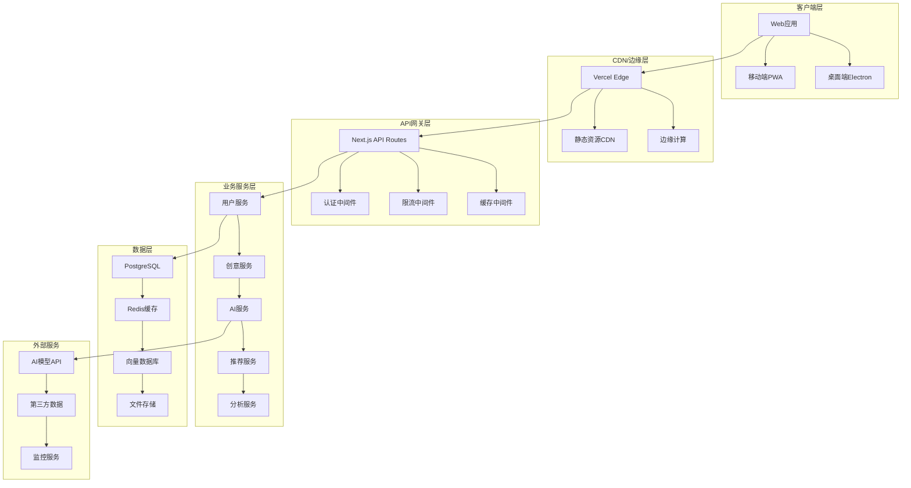

# 技术架构重构方案

## 🏗️ 当前架构分析

### 现有技术栈
- **前端**: Next.js 14 + TypeScript + Tailwind CSS + shadcn/ui
- **状态管理**: React Context API
- **AI集成**: LiteLLM统一接口
- **数据存储**: localStorage (客户端)
- **部署**: Vercel (推荐)

### 架构优势
1. **现代化技术栈**: Next.js 14 App Router提供良好的开发体验
2. **类型安全**: TypeScript确保代码质量
3. **组件化设计**: shadcn/ui提供一致的UI组件
4. **多模型支持**: LiteLLM统一不同AI提供商的接口

### 架构痛点
1. **状态管理复杂**: Context API在复杂状态下性能不佳
2. **数据持久化不足**: 仅依赖localStorage，缺乏云端同步
3. **缺乏后端服务**: 无用户系统、数据分析、推荐算法等
4. **性能瓶颈**: 大量数据时前端渲染压力大
5. **扩展性限制**: 难以支持协作、社区等高级功能

## 🎯 重构目标

### 核心目标
1. **提升性能**: 优化加载速度和响应时间
2. **增强扩展性**: 支持用户系统、协作功能、数据分析
3. **改善用户体验**: 实现个性化推荐、智能缓存
4. **保证可靠性**: 数据备份、错误恢复、监控告警
5. **降低维护成本**: 模块化架构、自动化部署

### 技术原则
1. **渐进式升级**: 保持现有功能正常运行
2. **向后兼容**: 确保用户数据不丢失
3. **性能优先**: 每个改动都要考虑性能影响
4. **用户体验**: 技术服务于产品和用户需求

## 🏛️ 新架构设计

### 整体架构图



### 技术栈升级

#### 前端技术栈
```typescript
// 新的技术栈配置
const techStack = {
  // 核心框架
  framework: 'Next.js 14',
  language: 'TypeScript 5.0+',
  
  // 状态管理
  stateManagement: 'Zustand + React Query',
  
  // UI框架
  ui: 'shadcn/ui + Tailwind CSS',
  animation: 'Framer Motion',
  
  // 数据获取
  dataFetching: 'TanStack Query (React Query)',
  
  // 表单处理
  forms: 'React Hook Form + Zod',
  
  // 路由
  routing: 'Next.js App Router',
  
  // 测试
  testing: 'Vitest + Testing Library',
  
  // 构建工具
  bundler: 'Turbopack (Next.js)',
  
  // 代码质量
  linting: 'ESLint + Prettier',
  typeChecking: 'TypeScript strict mode'
};
```

#### 后端服务架构
```typescript
// 微服务架构设计
interface ServiceArchitecture {
  // API网关
  gateway: {
    framework: 'Next.js API Routes';
    middleware: ['auth', 'rateLimit', 'cors', 'validation'];
    documentation: 'OpenAPI 3.0';
  };
  
  // 核心服务
  services: {
    userService: {
      responsibilities: ['authentication', 'profile', 'preferences'];
      database: 'PostgreSQL';
      cache: 'Redis';
    };
    
    ideaService: {
      responsibilities: ['generation', 'storage', 'search'];
      database: 'PostgreSQL + Vector DB';
      cache: 'Redis';
    };
    
    aiService: {
      responsibilities: ['model management', 'request routing'];
      providers: ['OpenAI', 'Anthropic', 'DeepSeek'];
      cache: 'Redis';
    };
    
    recommendationService: {
      responsibilities: ['user profiling', 'content recommendation'];
      algorithms: ['collaborative filtering', 'content-based'];
      database: 'Vector DB';
    };
  };
}
```

## 🔄 状态管理重构

### Zustand + React Query架构

#### 全局状态管理
```typescript
// stores/useAppStore.ts
import { create } from 'zustand';
import { devtools, persist } from 'zustand/middleware';

interface AppState {
  // 用户状态
  user: User | null;
  isAuthenticated: boolean;
  
  // UI状态
  theme: 'light' | 'dark' | 'system';
  sidebarOpen: boolean;
  
  // 应用设置
  preferences: UserPreferences;
  
  // 操作方法
  setUser: (user: User) => void;
  logout: () => void;
  updatePreferences: (prefs: Partial<UserPreferences>) => void;
  toggleSidebar: () => void;
}

export const useAppStore = create<AppState>()(
  devtools(
    persist(
      (set, get) => ({
        // 初始状态
        user: null,
        isAuthenticated: false,
        theme: 'system',
        sidebarOpen: true,
        preferences: defaultPreferences,
        
        // 操作方法
        setUser: (user) => set({ user, isAuthenticated: true }),
        logout: () => set({ user: null, isAuthenticated: false }),
        updatePreferences: (prefs) => 
          set((state) => ({ 
            preferences: { ...state.preferences, ...prefs } 
          })),
        toggleSidebar: () => 
          set((state) => ({ sidebarOpen: !state.sidebarOpen })),
      }),
      {
        name: 'app-storage',
        partialize: (state) => ({ 
          theme: state.theme,
          preferences: state.preferences 
        }),
      }
    )
  )
);
```

#### 服务器状态管理
```typescript
// hooks/useIdeas.ts
import { useQuery, useMutation, useQueryClient } from '@tanstack/react-query';

export const useIdeas = (userId?: string) => {
  return useQuery({
    queryKey: ['ideas', userId],
    queryFn: () => fetchUserIdeas(userId),
    enabled: !!userId,
    staleTime: 5 * 60 * 1000, // 5分钟
    cacheTime: 10 * 60 * 1000, // 10分钟
  });
};

export const useGenerateIdea = () => {
  const queryClient = useQueryClient();
  
  return useMutation({
    mutationFn: generateIdea,
    onSuccess: (data, variables) => {
      // 更新缓存
      queryClient.setQueryData(['ideas', variables.userId], (old: any) => {
        return old ? [...old, ...data.ideas] : data.ideas;
      });
      
      // 预取相关数据
      queryClient.prefetchQuery({
        queryKey: ['recommendations', variables.userId],
        queryFn: () => fetchRecommendations(variables.userId),
      });
    },
  });
};

// hooks/useRecommendations.ts
export const useRecommendations = (userId: string) => {
  return useQuery({
    queryKey: ['recommendations', userId],
    queryFn: () => fetchRecommendations(userId),
    enabled: !!userId,
    refetchOnWindowFocus: false,
    staleTime: 15 * 60 * 1000, // 15分钟
  });
};
```

## 🗄️ 数据库设计

### PostgreSQL主数据库

#### 核心表结构
```sql
-- 用户表
CREATE TABLE users (
    id UUID PRIMARY KEY DEFAULT gen_random_uuid(),
    email VARCHAR(255) UNIQUE NOT NULL,
    username VARCHAR(100) UNIQUE,
    avatar_url TEXT,
    profile JSONB DEFAULT '{}',
    preferences JSONB DEFAULT '{}',
    subscription_tier VARCHAR(20) DEFAULT 'free',
    created_at TIMESTAMP WITH TIME ZONE DEFAULT NOW(),
    updated_at TIMESTAMP WITH TIME ZONE DEFAULT NOW(),
    last_active_at TIMESTAMP WITH TIME ZONE DEFAULT NOW()
);

-- 创意表
CREATE TABLE ideas (
    id UUID PRIMARY KEY DEFAULT gen_random_uuid(),
    user_id UUID REFERENCES users(id) ON DELETE CASCADE,
    title VARCHAR(500) NOT NULL,
    description TEXT,
    content JSONB NOT NULL,
    metadata JSONB DEFAULT '{}',
    tags TEXT[] DEFAULT '{}',
    status VARCHAR(20) DEFAULT 'draft',
    visibility VARCHAR(20) DEFAULT 'private',
    version INTEGER DEFAULT 1,
    parent_id UUID REFERENCES ideas(id),
    created_at TIMESTAMP WITH TIME ZONE DEFAULT NOW(),
    updated_at TIMESTAMP WITH TIME ZONE DEFAULT NOW()
);

-- 对话记录表
CREATE TABLE conversations (
    id UUID PRIMARY KEY DEFAULT gen_random_uuid(),
    user_id UUID REFERENCES users(id) ON DELETE CASCADE,
    idea_id UUID REFERENCES ideas(id) ON DELETE CASCADE,
    messages JSONB NOT NULL DEFAULT '[]',
    context JSONB DEFAULT '{}',
    status VARCHAR(20) DEFAULT 'active',
    created_at TIMESTAMP WITH TIME ZONE DEFAULT NOW(),
    updated_at TIMESTAMP WITH TIME ZONE DEFAULT NOW()
);

-- 用户行为表
CREATE TABLE user_interactions (
    id UUID PRIMARY KEY DEFAULT gen_random_uuid(),
    user_id UUID REFERENCES users(id) ON DELETE CASCADE,
    idea_id UUID REFERENCES ideas(id) ON DELETE SET NULL,
    interaction_type VARCHAR(50) NOT NULL,
    interaction_data JSONB DEFAULT '{}',
    session_id VARCHAR(100),
    ip_address INET,
    user_agent TEXT,
    created_at TIMESTAMP WITH TIME ZONE DEFAULT NOW()
);

-- 推荐记录表
CREATE TABLE recommendations (
    id UUID PRIMARY KEY DEFAULT gen_random_uuid(),
    user_id UUID REFERENCES users(id) ON DELETE CASCADE,
    recommended_idea_id UUID REFERENCES ideas(id) ON DELETE CASCADE,
    recommendation_type VARCHAR(50) NOT NULL,
    score DECIMAL(5,4),
    context JSONB DEFAULT '{}',
    clicked BOOLEAN DEFAULT FALSE,
    clicked_at TIMESTAMP WITH TIME ZONE,
    created_at TIMESTAMP WITH TIME ZONE DEFAULT NOW()
);

-- 索引优化
CREATE INDEX idx_ideas_user_id ON ideas(user_id);
CREATE INDEX idx_ideas_status ON ideas(status);
CREATE INDEX idx_ideas_created_at ON ideas(created_at DESC);
CREATE INDEX idx_ideas_tags ON ideas USING GIN(tags);
CREATE INDEX idx_user_interactions_user_id ON user_interactions(user_id);
CREATE INDEX idx_user_interactions_type ON user_interactions(interaction_type);
CREATE INDEX idx_recommendations_user_id ON recommendations(user_id);
```

### Redis缓存策略

#### 缓存层设计
```typescript
// services/cacheService.ts
class CacheService {
  private redis: Redis;
  
  constructor() {
    this.redis = new Redis(process.env.REDIS_URL);
  }
  
  // 用户会话缓存
  async cacheUserSession(userId: string, sessionData: any) {
    await this.redis.setex(
      `session:${userId}`, 
      3600, // 1小时
      JSON.stringify(sessionData)
    );
  }
  
  // 创意生成结果缓存
  async cacheGenerationResult(query: string, result: any) {
    const key = `generation:${this.hashQuery(query)}`;
    await this.redis.setex(key, 1800, JSON.stringify(result)); // 30分钟
  }
  
  // 推荐结果缓存
  async cacheRecommendations(userId: string, recommendations: any[]) {
    await this.redis.setex(
      `recommendations:${userId}`,
      900, // 15分钟
      JSON.stringify(recommendations)
    );
  }
  
  // 热门内容缓存
  async cacheTrendingContent(content: any[]) {
    await this.redis.setex(
      'trending:ideas',
      3600, // 1小时
      JSON.stringify(content)
    );
  }
  
  private hashQuery(query: string): string {
    return crypto.createHash('md5').update(query).digest('hex');
  }
}
```

### 向量数据库集成

#### Pinecone/Weaviate集成
```typescript
// services/vectorService.ts
import { PineconeClient } from '@pinecone-database/pinecone';

class VectorService {
  private pinecone: PineconeClient;
  private index: any;
  
  constructor() {
    this.pinecone = new PineconeClient();
    this.initializeIndex();
  }
  
  async initializeIndex() {
    await this.pinecone.init({
      environment: process.env.PINECONE_ENVIRONMENT!,
      apiKey: process.env.PINECONE_API_KEY!,
    });
    
    this.index = this.pinecone.Index('ideas-index');
  }
  
  // 存储创意向量
  async storeIdeaVector(ideaId: string, content: string, metadata: any) {
    const embedding = await this.generateEmbedding(content);
    
    await this.index.upsert({
      upsertRequest: {
        vectors: [{
          id: ideaId,
          values: embedding,
          metadata: {
            ...metadata,
            content: content.substring(0, 1000), // 限制长度
          }
        }]
      }
    });
  }
  
  // 相似创意搜索
  async findSimilarIdeas(query: string, topK: number = 10) {
    const queryEmbedding = await this.generateEmbedding(query);
    
    const queryResponse = await this.index.query({
      queryRequest: {
        vector: queryEmbedding,
        topK,
        includeMetadata: true,
      }
    });
    
    return queryResponse.matches;
  }
  
  private async generateEmbedding(text: string): Promise<number[]> {
    // 使用OpenAI或其他embedding模型
    const response = await openai.embeddings.create({
      model: 'text-embedding-ada-002',
      input: text,
    });
    
    return response.data[0].embedding;
  }
}
```

## 🤖 AI服务架构

### 智能路由系统

#### AI模型管理
```typescript
// services/aiService.ts
interface ModelConfig {
  provider: string;
  model: string;
  maxTokens: number;
  temperature: number;
  costPerToken: number;
  capabilities: string[];
}

class AIService {
  private models: Map<string, ModelConfig> = new Map();
  private loadBalancer: LoadBalancer;
  
  constructor() {
    this.initializeModels();
    this.loadBalancer = new LoadBalancer();
  }
  
  private initializeModels() {
    // DeepSeek配置
    this.models.set('deepseek-chat', {
      provider: 'deepseek',
      model: 'deepseek-chat',
      maxTokens: 4096,
      temperature: 0.7,
      costPerToken: 0.000001,
      capabilities: ['generation', 'chat', 'analysis']
    });
    
    // Qwen配置
    this.models.set('qwen-plus', {
      provider: 'qwen',
      model: 'qwen-plus',
      maxTokens: 8192,
      temperature: 0.7,
      costPerToken: 0.000004,
      capabilities: ['generation', 'chat', 'analysis', 'reasoning']
    });
    
    // GPT-4配置
    this.models.set('gpt-4-turbo', {
      provider: 'openai',
      model: 'gpt-4-turbo-preview',
      maxTokens: 4096,
      temperature: 0.7,
      costPerToken: 0.00007,
      capabilities: ['generation', 'chat', 'analysis', 'reasoning', 'creativity']
    });
  }
  
  // 智能模型选择
  selectOptimalModel(task: AITask, userPrefs: UserPreferences): string {
    const requirements = this.analyzeTaskRequirements(task);
    const budget = userPrefs.budget || 'medium';
    
    // 根据任务类型、预算、性能要求选择模型
    if (requirements.creativity === 'high' && budget === 'high') {
      return 'gpt-4-turbo';
    } else if (requirements.reasoning === 'high') {
      return 'qwen-plus';
    } else {
      return 'deepseek-chat'; // 默认性价比选择
    }
  }
  
  // 请求路由和负载均衡
  async routeRequest(request: AIRequest): Promise<AIResponse> {
    const modelId = this.selectOptimalModel(request.task, request.userPrefs);
    const model = this.models.get(modelId)!;
    
    // 检查模型可用性
    if (!await this.loadBalancer.isModelAvailable(modelId)) {
      // 故障转移到备用模型
      const fallbackModel = this.getFallbackModel(modelId);
      return this.executeRequest(request, fallbackModel);
    }
    
    return this.executeRequest(request, model);
  }
  
  private async executeRequest(request: AIRequest, model: ModelConfig): Promise<AIResponse> {
    // 实际的AI请求执行
    // 包含重试、错误处理、结果缓存等逻辑
  }
}
```

### 智能缓存系统

#### 多层缓存架构
```typescript
// services/intelligentCache.ts
class IntelligentCache {
  private l1Cache: Map<string, any> = new Map(); // 内存缓存
  private l2Cache: Redis; // Redis缓存
  private l3Cache: Database; // 数据库缓存
  
  constructor() {
    this.l2Cache = new Redis(process.env.REDIS_URL);
  }
  
  async get(key: string): Promise<any> {
    // L1: 内存缓存
    if (this.l1Cache.has(key)) {
      return this.l1Cache.get(key);
    }
    
    // L2: Redis缓存
    const l2Result = await this.l2Cache.get(key);
    if (l2Result) {
      const data = JSON.parse(l2Result);
      this.l1Cache.set(key, data); // 回填L1
      return data;
    }
    
    // L3: 数据库缓存
    const l3Result = await this.l3Cache.get(key);
    if (l3Result) {
      await this.l2Cache.setex(key, 3600, JSON.stringify(l3Result)); // 回填L2
      this.l1Cache.set(key, l3Result); // 回填L1
      return l3Result;
    }
    
    return null;
  }
  
  async set(key: string, value: any, ttl: number = 3600) {
    // 同时写入所有层级
    this.l1Cache.set(key, value);
    await this.l2Cache.setex(key, ttl, JSON.stringify(value));
    await this.l3Cache.set(key, value, ttl);
  }
  
  // 智能预热
  async preheatCache(userId: string) {
    const userProfile = await this.getUserProfile(userId);
    const predictions = this.predictUserNeeds(userProfile);
    
    // 预加载可能需要的数据
    for (const prediction of predictions) {
      if (prediction.confidence > 0.7) {
        await this.preloadData(prediction.resource);
      }
    }
  }
}
```

## 📊 监控和分析系统

### 性能监控

#### 实时监控配置
```typescript
// monitoring/performanceMonitor.ts
class PerformanceMonitor {
  private metrics: Map<string, Metric[]> = new Map();
  
  // 页面性能监控
  trackPagePerformance(pageName: string) {
    if (typeof window !== 'undefined') {
      const observer = new PerformanceObserver((list) => {
        for (const entry of list.getEntries()) {
          this.recordMetric('page_load', {
            page: pageName,
            duration: entry.duration,
            timestamp: Date.now()
          });
        }
      });
      
      observer.observe({ entryTypes: ['navigation', 'paint'] });
    }
  }
  
  // API响应时间监控
  trackAPIPerformance(endpoint: string, duration: number, status: number) {
    this.recordMetric('api_response', {
      endpoint,
      duration,
      status,
      timestamp: Date.now()
    });
  }
  
  // 用户交互监控
  trackUserInteraction(action: string, element: string, duration?: number) {
    this.recordMetric('user_interaction', {
      action,
      element,
      duration,
      timestamp: Date.now()
    });
  }
  
  // 错误监控
  trackError(error: Error, context: any) {
    this.recordMetric('error', {
      message: error.message,
      stack: error.stack,
      context,
      timestamp: Date.now()
    });
    
    // 发送到错误追踪服务
    this.sendToErrorTracking(error, context);
  }
  
  private recordMetric(type: string, data: any) {
    if (!this.metrics.has(type)) {
      this.metrics.set(type, []);
    }
    
    this.metrics.get(type)!.push(data);
    
    // 定期上报指标
    this.scheduleMetricUpload();
  }
}
```

### 用户行为分析

#### 行为追踪系统
```typescript
// analytics/behaviorTracker.ts
class BehaviorTracker {
  private eventQueue: AnalyticsEvent[] = [];
  
  // 页面访问追踪
  trackPageView(page: string, userId?: string) {
    this.enqueueEvent({
      type: 'page_view',
      properties: {
        page,
        userId,
        timestamp: Date.now(),
        sessionId: this.getSessionId(),
        userAgent: navigator.userAgent,
        referrer: document.referrer
      }
    });
  }
  
  // 功能使用追踪
  trackFeatureUsage(feature: string, action: string, properties?: any) {
    this.enqueueEvent({
      type: 'feature_usage',
      properties: {
        feature,
        action,
        ...properties,
        timestamp: Date.now(),
        sessionId: this.getSessionId()
      }
    });
  }
  
  // 创意生成追踪
  trackIdeaGeneration(params: GenerationParams, result: GenerationResult) {
    this.enqueueEvent({
      type: 'idea_generation',
      properties: {
        inputLength: params.interests.length,
        generationType: params.generationType,
        model: params.model,
        resultCount: result.ideas.length,
        duration: result.duration,
        timestamp: Date.now()
      }
    });
  }
  
  // 用户满意度追踪
  trackUserSatisfaction(rating: number, feedback?: string, context?: any) {
    this.enqueueEvent({
      type: 'user_satisfaction',
      properties: {
        rating,
        feedback,
        context,
        timestamp: Date.now()
      }
    });
  }
  
  private enqueueEvent(event: AnalyticsEvent) {
    this.eventQueue.push(event);
    
    // 批量上报
    if (this.eventQueue.length >= 10) {
      this.flushEvents();
    }
  }
  
  private async flushEvents() {
    if (this.eventQueue.length === 0) return;
    
    const events = [...this.eventQueue];
    this.eventQueue = [];
    
    try {
      await fetch('/api/analytics', {
        method: 'POST',
        headers: { 'Content-Type': 'application/json' },
        body: JSON.stringify({ events })
      });
    } catch (error) {
      // 失败时重新加入队列
      this.eventQueue.unshift(...events);
    }
  }
}
```

## 🚀 部署和DevOps

### CI/CD流水线

#### GitHub Actions配置
```yaml
# .github/workflows/deploy.yml
name: Deploy to Production

on:
  push:
    branches: [main]
  pull_request:
    branches: [main]

jobs:
  test:
    runs-on: ubuntu-latest
    steps:
      - uses: actions/checkout@v3
      
      - name: Setup Node.js
        uses: actions/setup-node@v3
        with:
          node-version: '18'
          cache: 'npm'
      
      - name: Install dependencies
        run: npm ci
      
      - name: Run type check
        run: npm run type-check
      
      - name: Run linting
        run: npm run lint
      
      - name: Run tests
        run: npm run test
      
      - name: Build application
        run: npm run build

  deploy:
    needs: test
    runs-on: ubuntu-latest
    if: github.ref == 'refs/heads/main'
    
    steps:
      - uses: actions/checkout@v3
      
      - name: Deploy to Vercel
        uses: amondnet/vercel-action@v20
        with:
          vercel-token: ${{ secrets.VERCEL_TOKEN }}
          vercel-org-id: ${{ secrets.ORG_ID }}
          vercel-project-id: ${{ secrets.PROJECT_ID }}
          vercel-args: '--prod'
```

### 环境配置

#### 多环境管理
```typescript
// config/environment.ts
interface EnvironmentConfig {
  database: {
    url: string;
    maxConnections: number;
  };
  redis: {
    url: string;
    maxRetries: number;
  };
  ai: {
    providers: AIProviderConfig[];
    defaultModel: string;
  };
  monitoring: {
    enabled: boolean;
    sampleRate: number;
  };
}

const environments: Record<string, EnvironmentConfig> = {
  development: {
    database: {
      url: process.env.DEV_DATABASE_URL!,
      maxConnections: 5
    },
    redis: {
      url: process.env.DEV_REDIS_URL!,
      maxRetries: 3
    },
    ai: {
      providers: [
        { name: 'deepseek', apiKey: process.env.DEV_DEEPSEEK_KEY! }
      ],
      defaultModel: 'deepseek-chat'
    },
    monitoring: {
      enabled: false,
      sampleRate: 1.0
    }
  },
  
  production: {
    database: {
      url: process.env.DATABASE_URL!,
      maxConnections: 20
    },
    redis: {
      url: process.env.REDIS_URL!,
      maxRetries: 5
    },
    ai: {
      providers: [
        { name: 'deepseek', apiKey: process.env.DEEPSEEK_KEY! },
        { name: 'qwen', apiKey: process.env.QWEN_KEY! },
        { name: 'openai', apiKey: process.env.OPENAI_KEY! }
      ],
      defaultModel: 'deepseek-chat'
    },
    monitoring: {
      enabled: true,
      sampleRate: 0.1
    }
  }
};

export const config = environments[process.env.NODE_ENV || 'development'];
```

## 📈 性能优化策略

### 前端优化

#### 代码分割和懒加载
```typescript
// 路由级别代码分割
const HomePage = lazy(() => import('./pages/HomePage'));
const WorkflowPage = lazy(() => import('./pages/WorkflowPage'));
const AnalyticsPage = lazy(() => import('./pages/AnalyticsPage'));

// 组件级别懒加载
const HeavyChart = lazy(() => 
  import('./components/HeavyChart').then(module => ({
    default: module.HeavyChart
  }))
);

// 功能模块动态导入
const loadExportModule = () => import('./modules/export');
const loadAnalyticsModule = () => import('./modules/analytics');

// 预加载策略
const preloadCriticalModules = () => {
  // 预加载用户可能访问的模块
  import('./pages/WorkflowPage');
  import('./components/IdeaGenerator');
};
```

#### 缓存策略优化
```typescript
// utils/cacheStrategy.ts
class CacheStrategy {
  // 静态资源缓存
  static configureStaticCache() {
    if ('serviceWorker' in navigator) {
      navigator.serviceWorker.register('/sw.js');
    }
  }
  
  // API响应缓存
  static configureAPICache() {
    const cache = new Map();
    
    return {
      get: (key: string) => cache.get(key),
      set: (key: string, data: any, ttl: number) => {
        cache.set(key, { data, expires: Date.now() + ttl });
        
        // 自动清理过期缓存
        setTimeout(() => cache.delete(key), ttl);
      },
      clear: () => cache.clear()
    };
  }
  
  // 智能预取
  static setupIntelligentPrefetch() {
    const observer = new IntersectionObserver((entries) => {
      entries.forEach(entry => {
        if (entry.isIntersecting) {
          const prefetchUrl = entry.target.getAttribute('data-prefetch');
          if (prefetchUrl) {
            this.prefetchResource(prefetchUrl);
          }
        }
      });
    });
    
    document.querySelectorAll('[data-prefetch]').forEach(el => {
      observer.observe(el);
    });
  }
}
```

### 后端优化

#### 数据库查询优化
```sql
-- 创建复合索引
CREATE INDEX CONCURRENTLY idx_ideas_user_status_created 
ON ideas(user_id, status, created_at DESC);

-- 创建部分索引
CREATE INDEX CONCURRENTLY idx_ideas_public 
ON ideas(created_at DESC) 
WHERE visibility = 'public';

-- 创建表达式索引
CREATE INDEX CONCURRENTLY idx_ideas_title_search 
ON ideas USING gin(to_tsvector('english', title));

-- 查询优化示例
EXPLAIN (ANALYZE, BUFFERS) 
SELECT i.*, u.username 
FROM ideas i 
JOIN users u ON i.user_id = u.id 
WHERE i.status = 'published' 
  AND i.created_at > NOW() - INTERVAL '7 days'
ORDER BY i.created_at DESC 
LIMIT 20;
```

#### API性能优化
```typescript
// middleware/performanceMiddleware.ts
export const performanceMiddleware = (req: Request, res: Response, next: NextFunction) => {
  const start = Date.now();
  
  // 响应时间记录
  res.on('finish', () => {
    const duration = Date.now() - start;
    console.log(`${req.method} ${req.path} - ${duration}ms`);
    
    // 记录慢查询
    if (duration > 1000) {
      logger.warn('Slow API request', {
        method: req.method,
        path: req.path,
        duration,
        query: req.query,
        body: req.body
      });
    }
  });
  
  next();
};

// 数据库连接池优化
const pool = new Pool({
  connectionString: process.env.DATABASE_URL,
  max: 20, // 最大连接数
  idleTimeoutMillis: 30000,
  connectionTimeoutMillis: 2000,
});
```

## 🔒 安全性设计

### 认证和授权

#### JWT认证系统
```typescript
// auth/jwtAuth.ts
import jwt from 'jsonwebtoken';
import bcrypt from 'bcrypt';

class AuthService {
  private readonly JWT_SECRET = process.env.JWT_SECRET!;
  private readonly JWT_EXPIRES_IN = '7d';
  
  async login(email: string, password: string): Promise<AuthResult> {
    const user = await this.findUserByEmail(email);
    if (!user || !await bcrypt.compare(password, user.passwordHash)) {
      throw new Error('Invalid credentials');
    }
    
    const token = this.generateToken(user);
    const refreshToken = this.generateRefreshToken(user);
    
    return {
      user: this.sanitizeUser(user),
      token,
      refreshToken,
      expiresIn: this.JWT_EXPIRES_IN
    };
  }
  
  generateToken(user: User): string {
    return jwt.sign(
      { 
        userId: user.id, 
        email: user.email,
        role: user.role 
      },
      this.JWT_SECRET,
      { expiresIn: this.JWT_EXPIRES_IN }
    );
  }
  
  verifyToken(token: string): TokenPayload {
    try {
      return jwt.verify(token, this.JWT_SECRET) as TokenPayload;
    } catch (error) {
      throw new Error('Invalid token');
    }
  }
  
  async refreshToken(refreshToken: string): Promise<string> {
    const payload = this.verifyRefreshToken(refreshToken);
    const user = await this.findUserById(payload.userId);
    
    if (!user) {
      throw new Error('User not found');
    }
    
    return this.generateToken(user);
  }
}
```

### 数据安全

#### 敏感数据加密
```typescript
// security/encryption.ts
import crypto from 'crypto';

class EncryptionService {
  private readonly algorithm = 'aes-256-gcm';
  private readonly secretKey = crypto.scryptSync(process.env.ENCRYPTION_KEY!, 'salt', 32);
  
  encrypt(text: string): EncryptedData {
    const iv = crypto.randomBytes(16);
    const cipher = crypto.createCipher(this.algorithm, this.secretKey);
    cipher.setAAD(Buffer.from('additional-data'));
    
    let encrypted = cipher.update(text, 'utf8', 'hex');
    encrypted += cipher.final('hex');
    
    const authTag = cipher.getAuthTag();
    
    return {
      encrypted,
      iv: iv.toString('hex'),
      authTag: authTag.toString('hex')
    };
  }
  
  decrypt(encryptedData: EncryptedData): string {
    const decipher = crypto.createDecipher(this.algorithm, this.secretKey);
    decipher.setAAD(Buffer.from('additional-data'));
    decipher.setAuthTag(Buffer.from(encryptedData.authTag, 'hex'));
    
    let decrypted = decipher.update(encryptedData.encrypted, 'hex', 'utf8');
    decrypted += decipher.final('utf8');
    
    return decrypted;
  }
}
```

## 📋 迁移计划

### 渐进式迁移策略

#### Phase 1: 基础设施升级 (2-3周)
```typescript
// 迁移步骤1: 状态管理升级
const migrationPhase1 = {
  tasks: [
    '安装和配置Zustand + React Query',
    '创建新的store结构',
    '逐步迁移Context到Zustand',
    '实现数据获取hooks',
    '测试状态管理功能'
  ],
  
  rollbackPlan: '保留原有Context作为备份',
  
  successCriteria: [
    '所有状态操作正常工作',
    '性能指标无下降',
    '用户体验无影响'
  ]
};
```

#### Phase 2: 后端服务搭建 (3-4周)
```typescript
// 迁移步骤2: 后端服务
const migrationPhase2 = {
  tasks: [
    '搭建PostgreSQL数据库',
    '实现用户认证系统',
    '创建API路由',
    '数据迁移脚本',
    '缓存系统集成'
  ],
  
  dataMigration: {
    from: 'localStorage',
    to: 'PostgreSQL',
    strategy: 'gradual-sync'
  }
};
```

#### Phase 3: 功能增强 (4-5周)
```typescript
// 迁移步骤3: 新功能开发
const migrationPhase3 = {
  tasks: [
    '个性化推荐系统',
    '智能对话优化',
    '协作功能开发',
    '分析面板实现',
    '移动端优化'
  ]
};
```

---

*本技术架构重构方案提供了完整的升级路径，从状态管理到后端服务，从性能优化到安全设计。建议按阶段实施，确保每个阶段的稳定性后再进行下一阶段。*