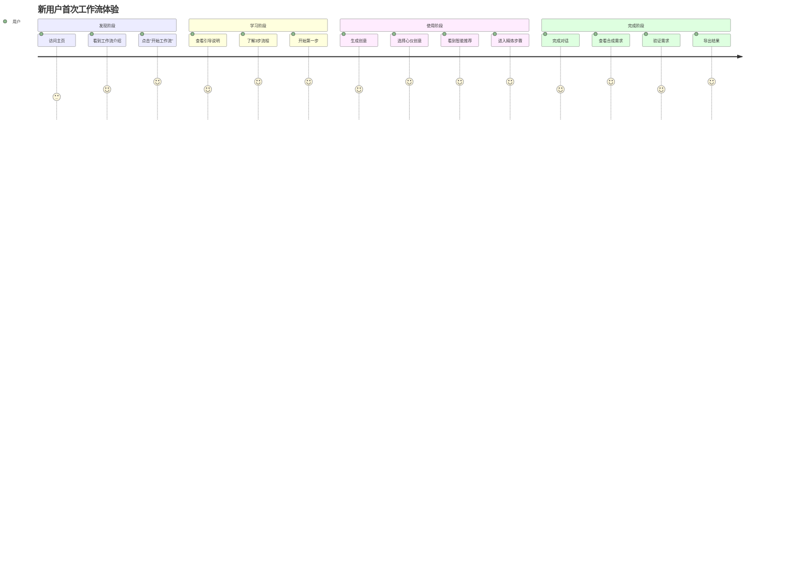
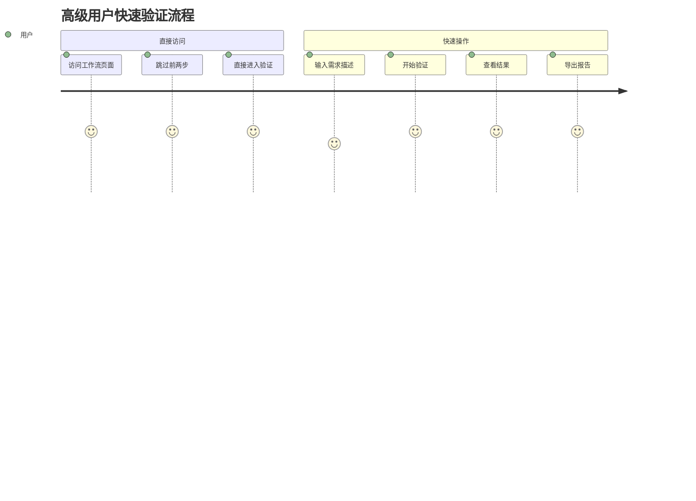

# 🎨 工作流系统用户体验设计指南

## 🎯 UX设计原则

### 1. 渐进式引导 (Progressive Disclosure)
- **分步展示**：每次只显示当前步骤相关的信息和操作
- **上下文提示**：根据用户当前状态提供相关帮助
- **智能推荐**：基于数据质量和用户行为提供个性化建议

### 2. 灵活性与控制感 (Flexibility & Control)
- **多路径支持**：完整流程 vs 跳步使用
- **随时编辑**：所有自动生成的内容都可编辑
- **可逆操作**：支持返回修改前面步骤

### 3. 反馈与透明度 (Feedback & Transparency)
- **实时状态**：清晰显示当前进度和完成状态
- **操作反馈**：每个操作都有明确的视觉反馈
- **数据来源**：说明自动生成内容的来源和逻辑

## 🚀 用户旅程设计

### 旅程1：新用户首次体验



### 旅程2：高级用户快速验证



## 🎨 视觉设计系统

### 1. 色彩系统

```css
/* 主色调 - 表示进度和成功 */
--primary-blue: #3B82F6;
--success-green: #10B981;
--warning-yellow: #F59E0B;
--error-red: #EF4444;

/* 状态色彩 */
--step-completed: var(--success-green);
--step-current: var(--primary-blue);
--step-skipped: var(--warning-yellow);
--step-upcoming: #9CA3AF;

/* 背景色彩 */
--bg-primary: #FFFFFF;
--bg-secondary: #F9FAFB;
--bg-accent: #F3F4F6;
```

### 2. 间距系统

```css
/* 组件间距 */
--space-xs: 0.25rem;   /* 4px */
--space-sm: 0.5rem;    /* 8px */
--space-md: 1rem;      /* 16px */
--space-lg: 1.5rem;    /* 24px */
--space-xl: 2rem;      /* 32px */
--space-2xl: 3rem;     /* 48px */

/* 布局间距 */
--container-padding: 1rem;
--section-gap: 2rem;
--card-padding: 1.5rem;
```

### 3. 字体系统

```css
/* 标题层级 */
.text-h1 { font-size: 2.25rem; font-weight: 700; line-height: 1.2; }
.text-h2 { font-size: 1.875rem; font-weight: 600; line-height: 1.3; }
.text-h3 { font-size: 1.5rem; font-weight: 600; line-height: 1.4; }
.text-h4 { font-size: 1.25rem; font-weight: 500; line-height: 1.4; }

/* 正文层级 */
.text-body-lg { font-size: 1.125rem; line-height: 1.6; }
.text-body { font-size: 1rem; line-height: 1.6; }
.text-body-sm { font-size: 0.875rem; line-height: 1.5; }
.text-caption { font-size: 0.75rem; line-height: 1.4; }
```

## 🧩 关键UI组件设计

### 1. 步骤指示器 (Step Indicator)

```typescript
interface StepIndicatorProps {
  steps: WorkflowStep[];
  currentStep: WorkflowStep;
  completedSteps: Set<WorkflowStep>;
  skippedSteps: Set<WorkflowStep>;
  onStepClick: (step: WorkflowStep) => void;
}

// 设计要点：
// - 清晰的视觉层次：完成 > 当前 > 跳过 > 待完成
// - 交互反馈：悬停效果、点击反馈
// - 响应式适配：桌面端横向，移动端纵向
// - 无障碍支持：键盘导航、屏幕阅读器
```

### 2. 数据传递卡片 (Data Transfer Card)

```typescript
interface DataTransferCardProps {
  title: string;
  sourceStep: WorkflowStep;
  data: any;
  onEdit: (newData: any) => void;
  editable?: boolean;
}

// 设计要点：
// - 明确的数据来源标识
// - 可折叠的详细信息
// - 内联编辑功能
// - 保存状态指示
```

### 3. 智能推荐面板 (Recommendation Panel)

```typescript
interface RecommendationPanelProps {
  recommendation: {
    nextStep: WorkflowStep;
    confidence: number;
    reasoning: string;
    alternatives: WorkflowStep[];
  };
  onAccept: (step: WorkflowStep) => void;
  onCustomize: () => void;
}

// 设计要点：
// - AI图标和品牌标识
// - 置信度可视化
// - 推理过程透明化
// - 明确的行动按钮
```

## 📱 响应式设计规范

### 1. 断点系统

```css
/* 移动端优先设计 */
@media (min-width: 640px) { /* sm */ }
@media (min-width: 768px) { /* md */ }
@media (min-width: 1024px) { /* lg */ }
@media (min-width: 1280px) { /* xl */ }
```

### 2. 布局适配

#### 桌面端 (≥1024px)
```
┌─────────────────────────────────────────┐
│ Header (固定)                            │
├─────────────────────────────────────────┤
│ Progress Bar (水平步骤指示器)             │
├─────────────────────────────────────────┤
│ ┌─────────┐ ┌─────────────────────────┐ │
│ │ 侧边栏   │ │ 主内容区                 │ │
│ │ - 步骤   │ │                        │ │
│ │ - 帮助   │ │                        │ │
│ │ - 历史   │ │                        │ │
│ └─────────┘ └─────────────────────────┘ │
├─────────────────────────────────────────┤
│ Navigation (导航控制)                    │
└─────────────────────────────────────────┘
```

#### 平板端 (768px-1023px)
```
┌─────────────────────────────────────────┐
│ Header (固定)                            │
├─────────────────────────────────────────┤
│ Progress Bar (水平步骤指示器)             │
├─────────────────────────────────────────┤
│                                         │
│ 主内容区 (全宽)                          │
│                                         │
│                                         │
├─────────────────────────────────────────┤
│ Navigation (导航控制)                    │
└─────────────────────────────────────────┘
```

#### 移动端 (<768px)
```
┌─────────────────────┐
│ Header (可折叠)      │
├─────────────────────┤
│ Mini Progress       │
├─────────────────────┤
│                     │
│ 主内容区 (全屏)      │
│                     │
│                     │
│                     │
├─────────────────────┤
│ Floating Navigation │
└─────────────────────┘
```

## 🎭 交互设计规范

### 1. 动画与过渡

```css
/* 页面切换动画 */
.page-transition {
  transition: all 0.3s cubic-bezier(0.4, 0, 0.2, 1);
}

/* 步骤切换动画 */
.step-transition-enter {
  opacity: 0;
  transform: translateX(20px);
}

.step-transition-enter-active {
  opacity: 1;
  transform: translateX(0);
  transition: all 0.3s ease-out;
}

/* 按钮交互 */
.button-hover {
  transition: all 0.2s ease;
}

.button-hover:hover {
  transform: translateY(-1px);
  box-shadow: 0 4px 12px rgba(0, 0, 0, 0.15);
}
```

### 2. 加载状态设计

```typescript
// 骨架屏组件
const SkeletonLoader = () => (
  <div className="animate-pulse">
    <div className="h-4 bg-gray-200 rounded w-3/4 mb-2"></div>
    <div className="h-4 bg-gray-200 rounded w-1/2 mb-2"></div>
    <div className="h-4 bg-gray-200 rounded w-5/6"></div>
  </div>
);

// 进度指示器
const ProgressSpinner = ({ message }: { message: string }) => (
  <div className="flex items-center gap-3">
    <div className="animate-spin rounded-full h-5 w-5 border-b-2 border-blue-600"></div>
    <span className="text-sm text-gray-600">{message}</span>
  </div>
);
```

### 3. 错误状态设计

```typescript
const ErrorState = ({ 
  title, 
  message, 
  onRetry 
}: {
  title: string;
  message: string;
  onRetry: () => void;
}) => (
  <div className="text-center py-8">
    <div className="w-16 h-16 mx-auto mb-4 bg-red-100 rounded-full flex items-center justify-center">
      <AlertCircle className="w-8 h-8 text-red-600" />
    </div>
    <h3 className="text-lg font-semibold text-gray-900 mb-2">{title}</h3>
    <p className="text-gray-600 mb-4">{message}</p>
    <Button onClick={onRetry} variant="outline">
      重试
    </Button>
  </div>
);
```

## 🔧 可用性优化

### 1. 键盘导航支持

```typescript
// 键盘快捷键映射
const keyboardShortcuts = {
  'ArrowLeft': () => goToPreviousStep(),
  'ArrowRight': () => goToNextStep(),
  'Escape': () => exitWorkflowMode(),
  'Enter': () => continueToNext(),
  'KeyS': (e: KeyboardEvent) => {
    if (e.ctrlKey || e.metaKey) {
      e.preventDefault();
      saveWorkflow();
    }
  }
};

// 焦点管理
useEffect(() => {
  const handleKeyDown = (e: KeyboardEvent) => {
    const handler = keyboardShortcuts[e.code];
    if (handler) {
      handler(e);
    }
  };
  
  document.addEventListener('keydown', handleKeyDown);
  return () => document.removeEventListener('keydown', handleKeyDown);
}, []);
```

### 2. 无障碍支持

```typescript
// ARIA 标签和角色
<nav role="navigation" aria-label="工作流步骤">
  <ol className="workflow-steps">
    {steps.map((step, index) => (
      <li key={step} role="tab" aria-selected={step === currentStep}>
        <button
          aria-label={`步骤 ${index + 1}: ${stepInfo.label}`}
          aria-describedby={`step-${step}-description`}
        >
          {stepInfo.label}
        </button>
        <div id={`step-${step}-description`} className="sr-only">
          {stepInfo.description}
        </div>
      </li>
    ))}
  </ol>
</nav>

// 屏幕阅读器支持
<div aria-live="polite" aria-atomic="true" className="sr-only">
  {announcements.map((announcement, index) => (
    <div key={index}>{announcement}</div>
  ))}
</div>
```

### 3. 性能优化

```typescript
// 组件懒加载
const GenerateStep = lazy(() => import('./GenerateStep'));
const RefineStep = lazy(() => import('./RefineStep'));
const ValidateStep = lazy(() => import('./ValidateStep'));

// 预加载下一步组件
useEffect(() => {
  const nextStep = getNextStep(currentStep);
  if (nextStep) {
    import(`./components/${nextStep}Step`);
  }
}, [currentStep]);

// 防抖保存
const debouncedSave = useMemo(
  () => debounce((data: WorkflowState) => {
    saveToLocalStorage(data);
  }, 2000),
  []
);
```

## 📊 用户反馈收集

### 1. 内置反馈机制

```typescript
const FeedbackWidget = () => {
  const [rating, setRating] = useState<number>(0);
  const [feedback, setFeedback] = useState<string>('');
  
  return (
    <div className="feedback-widget">
      <h4>这个步骤对您有帮助吗？</h4>
      <div className="rating-stars">
        {[1, 2, 3, 4, 5].map(star => (
          <button
            key={star}
            onClick={() => setRating(star)}
            className={star <= rating ? 'active' : ''}
          >
            ⭐
          </button>
        ))}
      </div>
      <textarea
        placeholder="告诉我们如何改进..."
        value={feedback}
        onChange={(e) => setFeedback(e.target.value)}
      />
      <Button onClick={submitFeedback}>提交反馈</Button>
    </div>
  );
};
```

### 2. 使用分析埋点

```typescript
// 关键用户行为追踪
const trackUserAction = (action: string, properties?: Record<string, any>) => {
  // 发送到分析服务
  analytics.track(action, {
    workflowId: state.workflowId,
    currentStep: state.currentStep,
    timestamp: Date.now(),
    ...properties
  });
};

// 使用示例
trackUserAction('step_completed', { step: 'generate', timeSpent: 120 });
trackUserAction('idea_selected', { ideaIndex: 2, ideaTitle: 'AI助手' });
trackUserAction('workflow_abandoned', { lastStep: 'refine', progress: 0.66 });
```

## 🎯 成功指标与测试

### 1. 关键指标定义

```typescript
interface UXMetrics {
  // 完成率指标
  workflowCompletionRate: number;      // 工作流完成率
  stepCompletionRate: Record<WorkflowStep, number>; // 各步骤完成率
  
  // 时间指标
  averageCompletionTime: number;       // 平均完成时间
  timePerStep: Record<WorkflowStep, number>; // 各步骤平均时间
  
  // 用户行为指标
  skipRate: Record<WorkflowStep, number>; // 各步骤跳过率
  backNavigationRate: number;          // 返回修改率
  
  // 满意度指标
  userSatisfactionScore: number;       // 用户满意度评分
  featureUsageRate: Record<string, number>; // 功能使用率
}
```

### 2. A/B测试框架

```typescript
const ABTestProvider = ({ children }: { children: ReactNode }) => {
  const [variant, setVariant] = useState<'A' | 'B'>('A');
  
  useEffect(() => {
    // 根据用户ID或随机分配变体
    const userVariant = getUserVariant();
    setVariant(userVariant);
  }, []);
  
  return (
    <ABTestContext.Provider value={{ variant }}>
      {children}
    </ABTestContext.Provider>
  );
};

// 使用示例
const StepIndicator = () => {
  const { variant } = useABTest();
  
  return variant === 'A' ? (
    <HorizontalStepIndicator />
  ) : (
    <VerticalStepIndicator />
  );
};
```

这个UX设计指南确保了工作流系统不仅功能完善，更重要的是提供了优秀的用户体验。通过渐进式引导、灵活控制和持续反馈，用户能够轻松完成从创意生成到需求验证的完整流程。