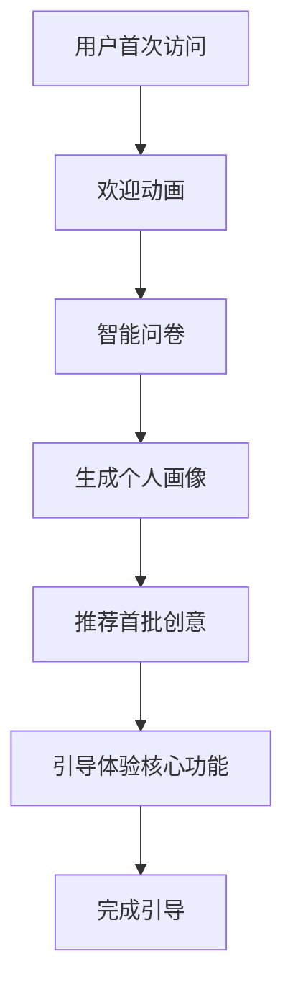
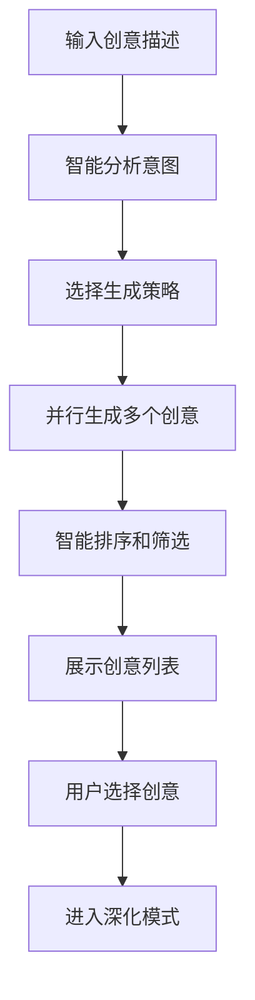

# 用户体验设计规范

## 🎨 视觉设计系统

### 1. 设计语言定义

#### 品牌个性
- **智能**: 体现AI的先进性和智能化
- **友好**: 降低技术门槛，让用户感到亲切
- **专业**: 保持商业工具的专业性
- **创新**: 鼓励创意思维和创新精神

#### 色彩系统
```css
/* 主色调 - 智能蓝 */
--primary-50: #eff6ff;
--primary-100: #dbeafe;
--primary-500: #3b82f6;
--primary-600: #2563eb;
--primary-900: #1e3a8a;

/* 辅助色 - 创意橙 */
--accent-50: #fff7ed;
--accent-100: #ffedd5;
--accent-500: #f97316;
--accent-600: #ea580c;

/* 功能色 */
--success: #10b981;
--warning: #f59e0b;
--error: #ef4444;
--info: #06b6d4;

/* 中性色 */
--gray-50: #f9fafb;
--gray-100: #f3f4f6;
--gray-500: #6b7280;
--gray-900: #111827;
```

#### 字体系统
```css
/* 字体族 */
--font-primary: 'Inter', -apple-system, BlinkMacSystemFont, sans-serif;
--font-mono: 'JetBrains Mono', 'Fira Code', monospace;
--font-chinese: 'PingFang SC', 'Hiragino Sans GB', 'Microsoft YaHei', sans-serif;

/* 字体大小 */
--text-xs: 0.75rem;    /* 12px */
--text-sm: 0.875rem;   /* 14px */
--text-base: 1rem;     /* 16px */
--text-lg: 1.125rem;   /* 18px */
--text-xl: 1.25rem;    /* 20px */
--text-2xl: 1.5rem;    /* 24px */
--text-3xl: 1.875rem;  /* 30px */
--text-4xl: 2.25rem;   /* 36px */

/* 行高 */
--leading-tight: 1.25;
--leading-normal: 1.5;
--leading-relaxed: 1.625;
```

### 2. 组件设计规范

#### 按钮系统
```typescript
interface ButtonVariants {
  primary: {
    background: 'gradient-to-r from-primary-500 to-primary-600';
    hover: 'from-primary-600 to-primary-700';
    text: 'white';
    shadow: 'lg';
  };
  secondary: {
    background: 'white';
    border: '2px solid primary-200';
    hover: 'primary-50';
    text: 'primary-700';
  };
  ghost: {
    background: 'transparent';
    hover: 'primary-50';
    text: 'primary-600';
  };
}
```

#### 卡片系统
```css
.card-base {
  @apply bg-white rounded-xl shadow-sm border border-gray-100;
  @apply hover:shadow-md transition-all duration-200;
}

.card-interactive {
  @apply card-base cursor-pointer;
  @apply hover:scale-[1.02] hover:border-primary-200;
}

.card-selected {
  @apply border-primary-300 bg-primary-50;
  @apply ring-2 ring-primary-200;
}
```

## 📱 界面布局设计

### 1. 新首页设计

#### 布局结构
```
┌─────────────────────────────────────────────────────┐
│                    顶部导航栏                        │
├─────────────────────────────────────────────────────┤
│                                                     │
│  ┌─────────────────┐  ┌─────────────────────────┐   │
│  │   个人仪表板     │  │      快速生成区域        │   │
│  │   - 今日推荐     │  │   🎯 今天想探索什么？    │   │
│  │   - 进行中项目   │  │   [智能输入框]          │   │
│  │   - 最近创意     │  │   [快速标签]            │   │
│  └─────────────────┘  └─────────────────────────┘   │
│                                                     │
│  ┌─────────────────────────────────────────────────┐ │
│  │              创意展示区域                        │ │
│  │  [创意卡片1] [创意卡片2] [创意卡片3]             │ │
│  └─────────────────────────────────────────────────┘ │
│                                                     │
│  ┌─────────────────────────────────────────────────┐ │
│  │              趋势洞察区域                        │ │
│  │  📈 市场趋势  💡 热门创意  🔥 新兴机会          │ │
│  └─────────────────────────────────────────────────┘ │
└─────────────────────────────────────────────────────┘
```

#### 响应式适配
```css
/* 桌面端 (1024px+) */
.dashboard-grid {
  @apply grid grid-cols-12 gap-6;
}

.personal-panel {
  @apply col-span-4;
}

.quick-generate {
  @apply col-span-8;
}

/* 平板端 (768px-1023px) */
@media (max-width: 1023px) {
  .dashboard-grid {
    @apply grid-cols-1 gap-4;
  }
  
  .personal-panel,
  .quick-generate {
    @apply col-span-1;
  }
}

/* 移动端 (< 768px) */
@media (max-width: 767px) {
  .dashboard-grid {
    @apply px-4 gap-3;
  }
}
```

### 2. 创意生成界面重设计

#### 智能输入区域
```jsx
const SmartInputArea = () => {
  return (
    <div className="bg-gradient-to-br from-primary-50 to-accent-50 rounded-2xl p-8">
      <div className="text-center mb-6">
        <h2 className="text-2xl font-bold text-gray-900 mb-2">
          🎯 今天想探索什么创意？
        </h2>
        <p className="text-gray-600">
          描述您的想法，AI将为您生成个性化的商业创意
        </p>
      </div>
      
      <div className="relative mb-6">
        <input
          type="text"
          placeholder="例如：结合AI和教育的创新产品..."
          className="w-full px-6 py-4 text-lg rounded-xl border-2 border-transparent bg-white shadow-sm focus:border-primary-300 focus:ring-4 focus:ring-primary-100"
        />
        <button className="absolute right-2 top-2 p-2 text-primary-500 hover:bg-primary-50 rounded-lg">
          🎤
        </button>
      </div>
      
      <div className="flex flex-wrap gap-2 mb-6">
        <span className="text-sm text-gray-500">💡 快速启发：</span>
        {['AI+教育', '可持续发展', '健康科技', '远程协作'].map(tag => (
          <button
            key={tag}
            className="px-3 py-1 bg-white rounded-full text-sm text-primary-600 hover:bg-primary-50 border border-primary-200"
          >
            {tag}
          </button>
        ))}
      </div>
    </div>
  );
};
```

### 3. 创意卡片重设计

#### 新卡片布局
```jsx
const IdeaCard = ({ idea, isSelected, onSelect }) => {
  return (
    <div className={`
      relative p-6 rounded-xl border-2 transition-all duration-200 cursor-pointer
      ${isSelected 
        ? 'border-primary-300 bg-primary-50 shadow-lg scale-105' 
        : 'border-gray-200 bg-white hover:border-primary-200 hover:shadow-md'
      }
    `}>
      {/* 标签区域 */}
      <div className="flex items-center justify-between mb-4">
        <div className="flex gap-2">
          <span className="px-2 py-1 bg-accent-100 text-accent-700 rounded-full text-xs font-medium">
            {idea.industry}
          </span>
          <span className="px-2 py-1 bg-green-100 text-green-700 rounded-full text-xs font-medium">
            {idea.difficulty}
          </span>
        </div>
        <button className="p-1 hover:bg-gray-100 rounded">
          ❤️
        </button>
      </div>
      
      {/* 主要内容 */}
      <h3 className="text-lg font-semibold text-gray-900 mb-2 line-clamp-2">
        {idea.title}
      </h3>
      <p className="text-gray-600 text-sm mb-4 line-clamp-3">
        {idea.description}
      </p>
      
      {/* 关键信息 */}
      <div className="space-y-2 mb-4">
        <div className="flex items-center text-sm">
          <span className="w-16 text-gray-500">市场：</span>
          <span className="text-gray-700">{idea.targetMarket}</span>
        </div>
        <div className="flex items-center text-sm">
          <span className="w-16 text-gray-500">模式：</span>
          <span className="text-gray-700">{idea.revenueModel}</span>
        </div>
      </div>
      
      {/* 操作按钮 */}
      <div className="flex gap-2">
        <button
          onClick={onSelect}
          className="flex-1 py-2 bg-primary-500 text-white rounded-lg hover:bg-primary-600 transition-colors"
        >
          选择这个创意
        </button>
        <button className="p-2 border border-gray-300 rounded-lg hover:bg-gray-50">
          📋
        </button>
        <button className="p-2 border border-gray-300 rounded-lg hover:bg-gray-50">
          🔗
        </button>
      </div>
    </div>
  );
};
```

## 🔄 交互流程设计

### 1. 用户引导流程

#### 首次访问引导


#### 引导步骤设计
```jsx
const OnboardingFlow = () => {
  const steps = [
    {
      title: "欢迎来到AI创意工坊！",
      description: "让我们用几个问题了解您，为您定制专属的创意体验",
      component: <WelcomeStep />
    },
    {
      title: "告诉我们您的背景",
      description: "这将帮助我们推荐最适合您的创意方向",
      component: <ProfileStep />
    },
    {
      title: "您的兴趣领域",
      description: "选择您感兴趣的行业和问题类型",
      component: <InterestsStep />
    },
    {
      title: "个性化完成！",
      description: "基于您的信息，我们为您准备了这些创意",
      component: <RecommendationsStep />
    }
  ];
  
  return <StepperComponent steps={steps} />;
};
```

### 2. 创意生成流程优化

#### 新的生成流程


#### 渐进式生成
```jsx
const ProgressiveGeneration = () => {
  const [stage, setStage] = useState('analyzing');
  
  const stages = {
    analyzing: {
      title: "🧠 分析您的需求",
      description: "AI正在理解您的创意方向...",
      progress: 25
    },
    generating: {
      title: "💡 生成创意方案",
      description: "基于市场趋势和您的偏好生成创意...",
      progress: 60
    },
    optimizing: {
      title: "✨ 优化和排序",
      description: "为您筛选最有潜力的创意...",
      progress: 90
    },
    complete: {
      title: "🎉 创意生成完成",
      description: "为您准备了5个精选创意",
      progress: 100
    }
  };
  
  return (
    <div className="text-center py-12">
      <div className="mb-6">
        <div className="w-16 h-16 mx-auto mb-4 bg-primary-100 rounded-full flex items-center justify-center">
          <LoadingSpinner />
        </div>
        <h3 className="text-xl font-semibold mb-2">
          {stages[stage].title}
        </h3>
        <p className="text-gray-600">
          {stages[stage].description}
        </p>
      </div>
      
      <div className="w-full max-w-md mx-auto">
        <ProgressBar progress={stages[stage].progress} />
      </div>
    </div>
  );
};
```

### 3. 对话体验优化

#### 智能对话界面
```jsx
const EnhancedChatInterface = () => {
  return (
    <div className="flex flex-col h-[600px] bg-white rounded-xl shadow-lg">
      {/* 对话头部 */}
      <div className="flex items-center p-4 border-b bg-gradient-to-r from-primary-50 to-accent-50">
        <div className="w-10 h-10 bg-primary-500 rounded-full flex items-center justify-center mr-3">
          🤖
        </div>
        <div>
          <h3 className="font-semibold">AI创意导师</h3>
          <p className="text-sm text-gray-600">让我们一起完善您的创意</p>
        </div>
        <div className="ml-auto flex gap-2">
          <button className="p-2 hover:bg-white rounded-lg">💾</button>
          <button className="p-2 hover:bg-white rounded-lg">📋</button>
        </div>
      </div>
      
      {/* 消息区域 */}
      <div className="flex-1 overflow-y-auto p-4 space-y-4">
        {messages.map((message, index) => (
          <ChatMessage key={index} message={message} />
        ))}
        
        {/* 智能建议 */}
        {suggestions.length > 0 && (
          <div className="bg-blue-50 rounded-lg p-4">
            <p className="text-sm font-medium text-blue-900 mb-2">
              💡 您可以这样回答：
            </p>
            <div className="space-y-2">
              {suggestions.map((suggestion, index) => (
                <button
                  key={index}
                  className="block w-full text-left p-2 text-sm bg-white rounded border hover:border-blue-300"
                  onClick={() => selectSuggestion(suggestion)}
                >
                  {suggestion}
                </button>
              ))}
            </div>
          </div>
        )}
      </div>
      
      {/* 输入区域 */}
      <div className="p-4 border-t">
        <div className="flex gap-2">
          <input
            type="text"
            placeholder="输入您的想法..."
            className="flex-1 px-4 py-2 border rounded-lg focus:outline-none focus:border-primary-300"
          />
          <button className="px-4 py-2 bg-primary-500 text-white rounded-lg hover:bg-primary-600">
            发送
          </button>
        </div>
        
        {/* 快捷操作 */}
        <div className="flex gap-2 mt-2">
          <button className="text-xs px-2 py-1 bg-gray-100 rounded">🎤 语音</button>
          <button className="text-xs px-2 py-1 bg-gray-100 rounded">📷 图片</button>
          <button className="text-xs px-2 py-1 bg-gray-100 rounded">📊 数据</button>
        </div>
      </div>
    </div>
  );
};
```

## 📊 个性化系统设计

### 1. 用户画像构建

#### 数据收集策略
```typescript
interface UserDataCollection {
  // 显式数据收集
  explicit: {
    onboardingQuestions: OnboardingResponse[];
    preferences: UserPreferences;
    feedback: UserFeedback[];
  };
  
  // 隐式行为数据
  implicit: {
    clickstream: ClickEvent[];
    timeSpent: TimeSpentData[];
    searchQueries: SearchQuery[];
    generationPatterns: GenerationPattern[];
  };
  
  // 外部数据源
  external: {
    industryTrends: TrendData[];
    marketData: MarketInsight[];
    competitorAnalysis: CompetitorData[];
  };
}
```

#### 画像更新机制
```typescript
class UserProfileEngine {
  updateProfile(userId: string, newData: UserInteraction) {
    // 1. 实时更新兴趣权重
    this.updateInterestWeights(userId, newData);
    
    // 2. 调整推荐策略
    this.adjustRecommendationStrategy(userId);
    
    // 3. 更新UI个性化设置
    this.updateUIPreferences(userId);
    
    // 4. 触发重新推荐
    this.triggerRecommendationRefresh(userId);
  }
  
  private calculateInterestScore(
    userHistory: UserHistory,
    contentFeatures: ContentFeatures
  ): number {
    // 兴趣匹配算法
    return this.cosineSimilarity(
      userHistory.interestVector,
      contentFeatures.featureVector
    );
  }
}
```

### 2. 智能推荐算法

#### 多策略推荐系统
```typescript
class RecommendationEngine {
  generateRecommendations(userId: string): Recommendation[] {
    const userProfile = this.getUserProfile(userId);
    
    // 1. 协同过滤推荐
    const collaborativeRecs = this.collaborativeFiltering(userProfile);
    
    // 2. 内容基础推荐
    const contentBasedRecs = this.contentBasedFiltering(userProfile);
    
    // 3. 趋势推荐
    const trendingRecs = this.trendingRecommendations(userProfile);
    
    // 4. 多样性推荐
    const diversityRecs = this.diversityRecommendations(userProfile);
    
    // 5. 混合推荐策略
    return this.hybridRecommendation([
      { source: collaborativeRecs, weight: 0.4 },
      { source: contentBasedRecs, weight: 0.3 },
      { source: trendingRecs, weight: 0.2 },
      { source: diversityRecs, weight: 0.1 }
    ]);
  }
}
```

### 3. 自适应界面系统

#### 动态布局调整
```typescript
interface AdaptiveLayout {
  // 基于使用频率调整功能位置
  adjustFunctionPlacement(userBehavior: UserBehavior): LayoutConfig;
  
  // 基于设备和偏好调整信息密度
  adjustInformationDensity(deviceInfo: DeviceInfo, userPrefs: UserPreferences): DensityConfig;
  
  // 基于时间和情境调整界面主题
  adjustTheme(timeContext: TimeContext, userMood: UserMood): ThemeConfig;
}

const adaptiveLayoutEngine = {
  updateLayout(userId: string) {
    const behavior = this.getUserBehavior(userId);
    const preferences = this.getUserPreferences(userId);
    
    // 调整快捷操作位置
    if (behavior.frequentActions.includes('generate')) {
      this.moveToTopLevel('generateButton');
    }
    
    // 调整信息展示密度
    if (preferences.informationDensity === 'compact') {
      this.enableCompactMode();
    }
    
    // 调整色彩主题
    if (behavior.activeHours.includes('night')) {
      this.suggestDarkMode();
    }
  }
};
```

## 🎯 性能优化策略

### 1. 前端性能优化

#### 代码分割策略
```typescript
// 路由级别的代码分割
const HomePage = lazy(() => import('./pages/HomePage'));
const WorkflowPage = lazy(() => import('./pages/WorkflowPage'));
const ChatPage = lazy(() => import('./pages/ChatPage'));

// 组件级别的懒加载
const HeavyChart = lazy(() => import('./components/HeavyChart'));
const AdvancedEditor = lazy(() => import('./components/AdvancedEditor'));

// 功能模块的动态导入
const loadAnalyticsModule = () => import('./modules/analytics');
const loadExportModule = () => import('./modules/export');
```

#### 缓存策略
```typescript
class CacheManager {
  // 用户数据缓存
  private userCache = new Map<string, UserData>();
  
  // 创意内容缓存
  private ideaCache = new LRUCache<string, BusinessIdea[]>({ max: 100 });
  
  // API响应缓存
  private apiCache = new Map<string, { data: any; timestamp: number }>();
  
  getCachedIdeas(query: string): BusinessIdea[] | null {
    const cached = this.ideaCache.get(query);
    if (cached && this.isValidCache(cached.timestamp)) {
      return cached.data;
    }
    return null;
  }
  
  setCachedIdeas(query: string, ideas: BusinessIdea[]) {
    this.ideaCache.set(query, {
      data: ideas,
      timestamp: Date.now()
    });
  }
}
```

### 2. 渲染优化

#### 虚拟滚动实现
```jsx
const VirtualizedIdeaList = ({ ideas, itemHeight = 200 }) => {
  const [visibleRange, setVisibleRange] = useState({ start: 0, end: 10 });
  const containerRef = useRef<HTMLDivElement>(null);
  
  const handleScroll = useCallback(
    throttle(() => {
      if (!containerRef.current) return;
      
      const scrollTop = containerRef.current.scrollTop;
      const containerHeight = containerRef.current.clientHeight;
      
      const start = Math.floor(scrollTop / itemHeight);
      const end = Math.min(
        start + Math.ceil(containerHeight / itemHeight) + 2,
        ideas.length
      );
      
      setVisibleRange({ start, end });
    }, 16),
    [itemHeight, ideas.length]
  );
  
  const visibleItems = ideas.slice(visibleRange.start, visibleRange.end);
  
  return (
    <div
      ref={containerRef}
      className="h-full overflow-auto"
      onScroll={handleScroll}
    >
      <div style={{ height: ideas.length * itemHeight }}>
        <div
          style={{
            transform: `translateY(${visibleRange.start * itemHeight}px)`
          }}
        >
          {visibleItems.map((idea, index) => (
            <IdeaCard
              key={visibleRange.start + index}
              idea={idea}
              style={{ height: itemHeight }}
            />
          ))}
        </div>
      </div>
    </div>
  );
};
```

### 3. 网络优化

#### 智能预加载
```typescript
class PreloadManager {
  // 预测用户下一步操作
  predictNextAction(userBehavior: UserBehavior): PredictedAction[] {
    const patterns = this.analyzePatterns(userBehavior);
    return this.generatePredictions(patterns);
  }
  
  // 预加载相关数据
  preloadData(predictions: PredictedAction[]) {
    predictions.forEach(prediction => {
      if (prediction.confidence > 0.7) {
        this.prefetchData(prediction.resource);
      }
    });
  }
  
  // 智能缓存清理
  cleanupCache() {
    const now = Date.now();
    const maxAge = 30 * 60 * 1000; // 30分钟
    
    this.cache.forEach((value, key) => {
      if (now - value.timestamp > maxAge) {
        this.cache.delete(key);
      }
    });
  }
}
```

## 📱 移动端优化

### 1. 触摸交互优化

#### 手势识别系统
```typescript
class GestureManager {
  private gestures = new Map<string, GestureHandler>();
  
  registerGesture(name: string, handler: GestureHandler) {
    this.gestures.set(name, handler);
  }
  
  handleTouch(event: TouchEvent) {
    const gesture = this.recognizeGesture(event);
    const handler = this.gestures.get(gesture.type);
    
    if (handler) {
      handler.execute(gesture);
    }
  }
  
  private recognizeGesture(event: TouchEvent): Gesture {
    // 手势识别逻辑
    // 支持：滑动、长按、双击、捏合等
  }
}

// 使用示例
const gestureManager = new GestureManager();

gestureManager.registerGesture('swipeLeft', {
  execute: (gesture) => {
    // 左滑收藏创意
    favoriteIdea(currentIdea);
  }
});

gestureManager.registerGesture('swipeRight', {
  execute: (gesture) => {
    // 右滑分享创意
    shareIdea(currentIdea);
  }
});
```

### 2. 移动端专属功能

#### 语音输入集成
```jsx
const VoiceInput = ({ onTranscript }) => {
  const [isListening, setIsListening] = useState(false);
  const [transcript, setTranscript] = useState('');
  
  const startListening = () => {
    if ('webkitSpeechRecognition' in window) {
      const recognition = new webkitSpeechRecognition();
      recognition.continuous = true;
      recognition.interimResults = true;
      recognition.lang = 'zh-CN';
      
      recognition.onstart = () => setIsListening(true);
      recognition.onend = () => setIsListening(false);
      
      recognition.onresult = (event) => {
        const result = event.results[event.results.length - 1];
        if (result.isFinal) {
          setTranscript(result[0].transcript);
          onTranscript(result[0].transcript);
        }
      };
      
      recognition.start();
    }
  };
  
  return (
    <button
      onClick={startListening}
      className={`p-3 rounded-full transition-all ${
        isListening 
          ? 'bg-red-500 text-white animate-pulse' 
          : 'bg-primary-500 text-white hover:bg-primary-600'
      }`}
    >
      {isListening ? '🔴' : '🎤'}
    </button>
  );
};
```

#### 离线支持
```typescript
class OfflineManager {
  private cache = new Map<string, CachedData>();
  
  // 缓存关键数据
  cacheEssentialData(data: EssentialData) {
    localStorage.setItem('offline_cache', JSON.stringify(data));
  }
  
  // 离线模式检测
  detectOfflineMode() {
    return !navigator.onLine;
  }
  
  // 离线功能降级
  getOfflineCapabilities(): OfflineCapability[] {
    return [
      'viewCachedIdeas',
      'editDrafts',
      'takeNotes',
      'reviewHistory'
    ];
  }
  
  // 网络恢复时同步
  syncWhenOnline() {
    window.addEventListener('online', () => {
      this.syncOfflineChanges();
    });
  }
}
```

---

*本设计规范涵盖了用户体验的各个方面，从视觉设计到交互流程，从个性化系统到性能优化。建议按优先级逐步实施，持续收集用户反馈并迭代改进。*