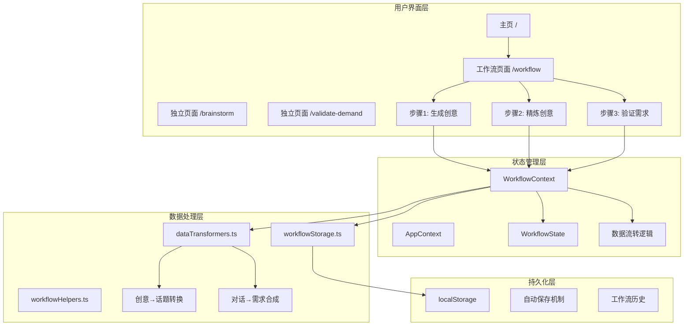
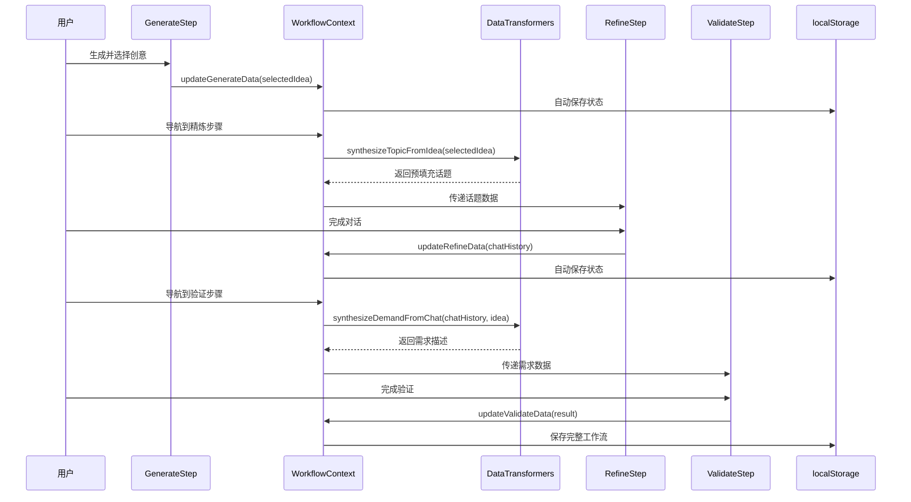
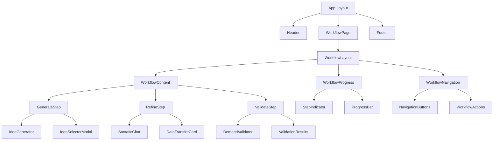
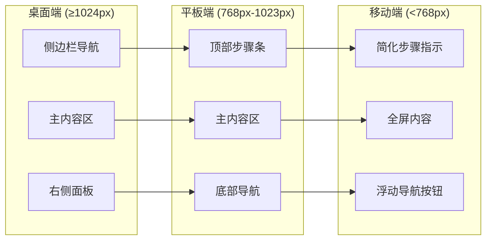
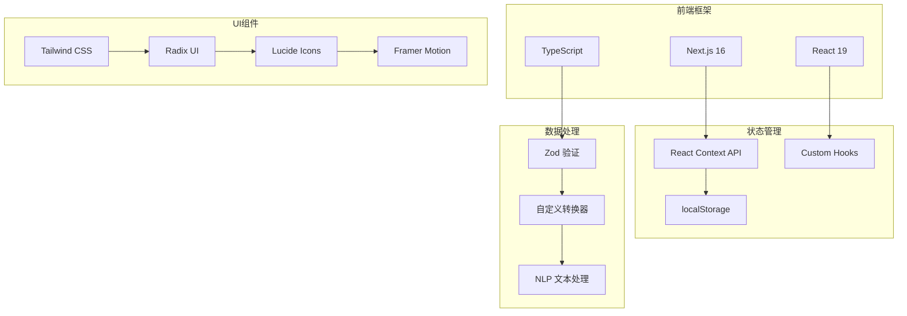
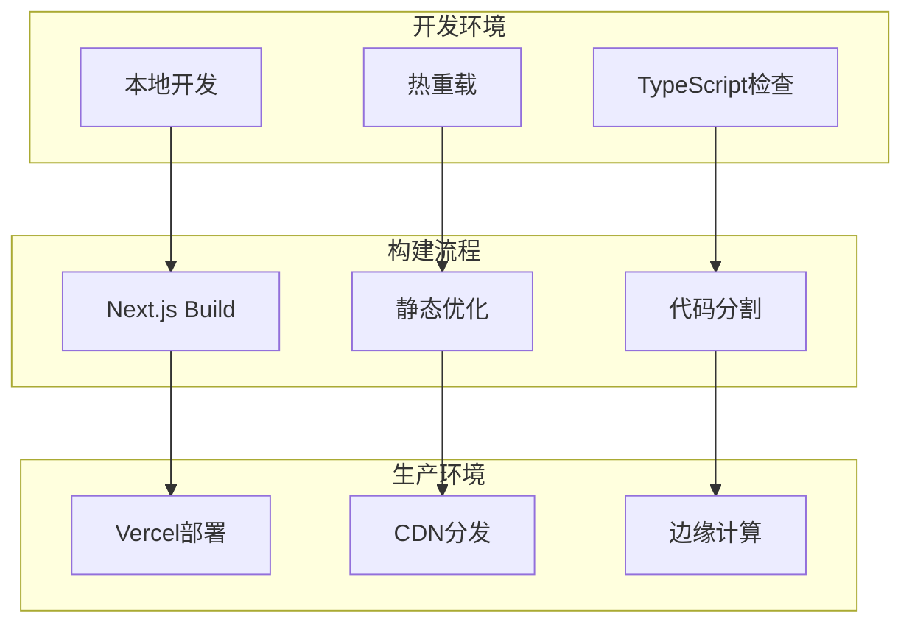
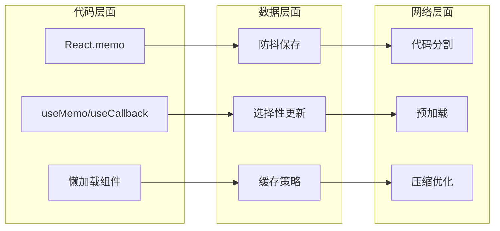
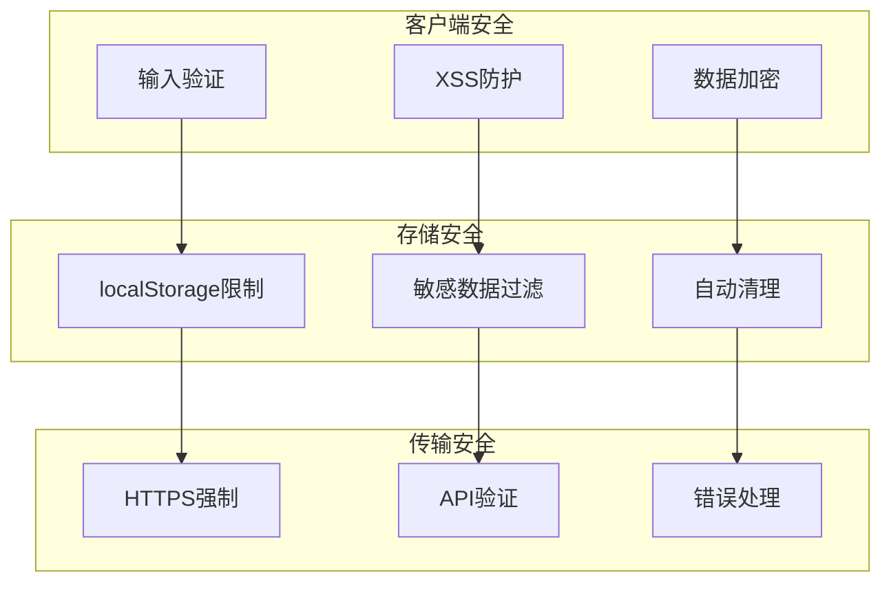
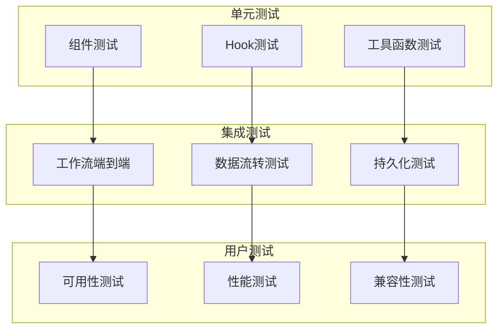
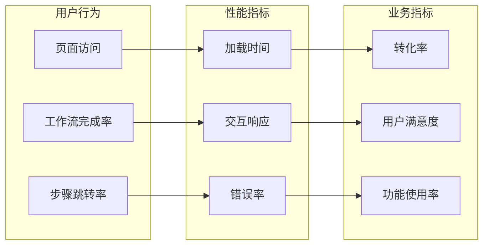

# 🏗️ 工作流系统架构图

## 📊 系统架构概览

## 🔄 数据流转架构

## 🧩 组件层次结构

## 📱 响应式设计架构

## 🔧 技术栈架构

## 🚀 部署架构

## 📊 性能优化架构

## 🔒 数据安全架构

## 🧪 测试架构

## 📈 监控架构

这个架构图展示了整个工作流系统的技术设计，从用户界面到数据处理，从状态管理到性能优化，提供了完整的技术实现蓝图。每个层次都有明确的职责分工，确保系统的可维护性和可扩展性。